# 🗄️ DynamoDB vs S3 — Where Should Data Live?

> **Core Question:** Both store data — but they are optimized for fundamentally different problems.  
> Choosing the wrong one costs money *and* performance.

---

## 📖 Table of Contents

1. [The Core Difference](#1-the-core-difference)
2. [DynamoDB — Optimized for Access](#2-dynamodb--optimized-for-access)
3. [S3 — Optimized for Durable Storage](#3-s3--optimized-for-durable-storage)
4. [Data Lifecycle — The Real Decision Driver](#4-data-lifecycle--the-real-decision-driver)
5. [What S3 Powers at Internet Scale](#5-what-s3-powers-at-internet-scale)
6. [Side-by-Side Comparison](#6-side-by-side-comparison)
7. [Decision Guide](#7-decision-guide)
8. [Quick Revision Cheatsheet](#8-quick-revision-cheatsheet)

---

## 1. The Core Difference

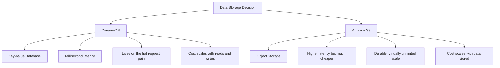

> 💡 Both store data — but DynamoDB is a **database** built for access speed.  
> S3 is a **storage system** built for durability and scale.

---

## 2. DynamoDB — Optimized for Access

> **Built for:** Predictable, low-latency access to data at massive scale.

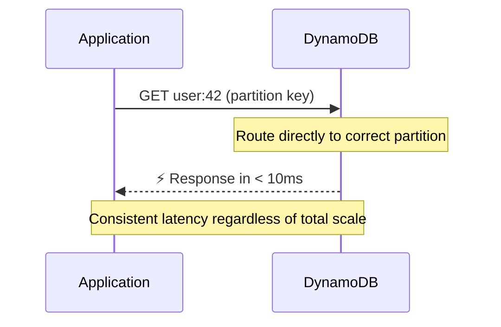

### How DynamoDB Routes Requests

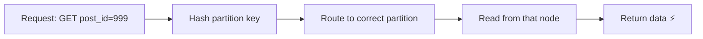

| Characteristic | Detail |
|---|---|
| **Access pattern** | Key-value lookup by partition key |
| **Latency** | Single-digit milliseconds |
| **Pricing driver** | Read/Write Capacity Units (throughput) |
| **Best for** | Live app data sitting on the hot request path |
| **Table classes** | Standard (hot data) · Standard-IA (infrequent access) |
| **Max item size** | 400 KB per item |

> ⚠️ **Cost Warning:** DynamoDB Standard-IA is cheaper for storage but read costs are higher.  
> If your data is so cold you barely access it — it probably shouldn't be in DynamoDB at all.

---

## 3. S3 — Optimized for Durable Storage

> **Built for:** Storing massive amounts of data cheaply with extremely high durability.

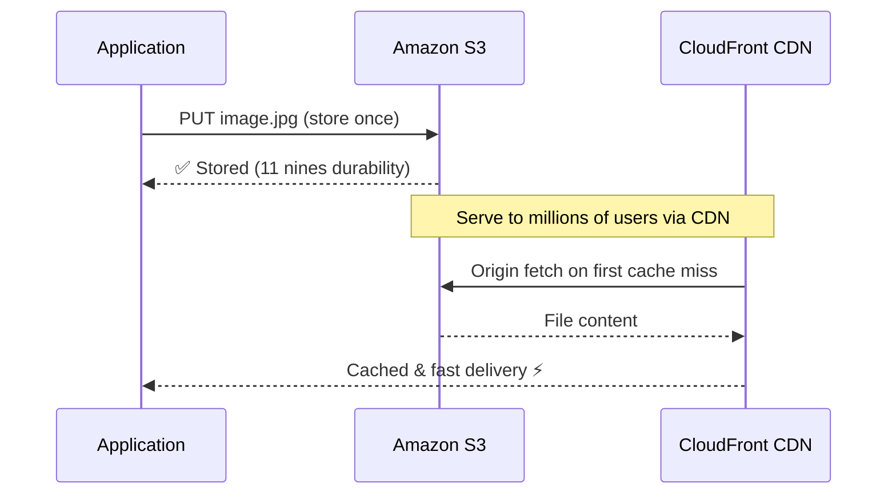

### S3 Storage Classes (Cost vs Speed)

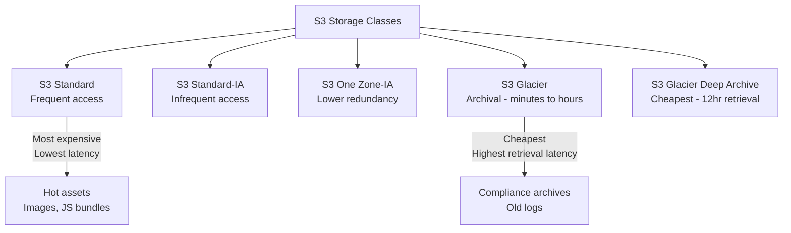

| Characteristic | Detail |
|---|---|
| **Access pattern** | Object key lookup (not query-able like SQL) |
| **Latency** | Tens to hundreds of milliseconds |
| **Pricing driver** | GB stored + per-request cost |
| **Best for** | Static assets, archives, data lakes, backups |
| **Durability** | 99.999999999% (11 nines) |
| **Max object size** | 5 TB per object |

---

## 4. Data Lifecycle — The Real Decision Driver

> Most data **doesn't stay hot forever**. It follows a lifecycle —  
> and the right storage system depends on **where in the lifecycle it is**.

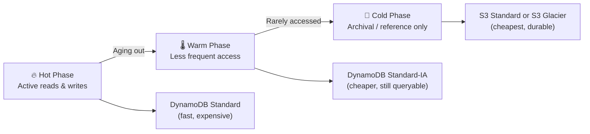

### Real-World Example — Messaging System

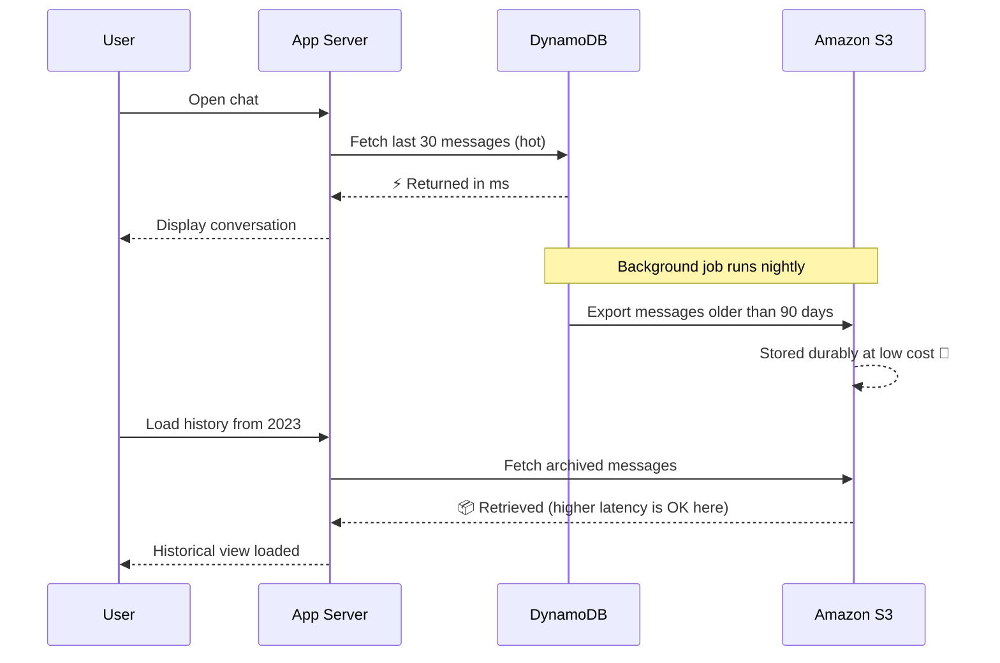

> 💡 **Pattern:** Keep recent data in DynamoDB for speed.  
> Offload aged data to S3 for cost. Queries on archived data are rare — latency is acceptable.

---

## 5. What S3 Powers at Internet Scale

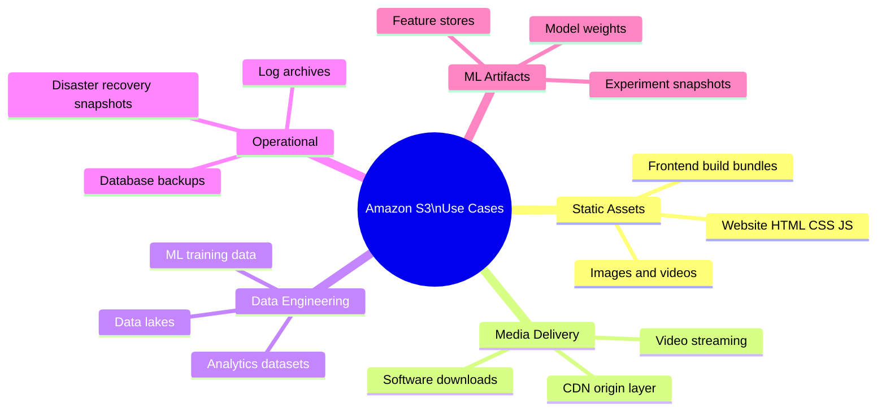

> S3 often acts as the **backbone storage layer** for large portions of the internet —  
> not because it's fast, but because it's **cheap, durable, and infinitely scalable**.

---

## 6. Side-by-Side Comparison

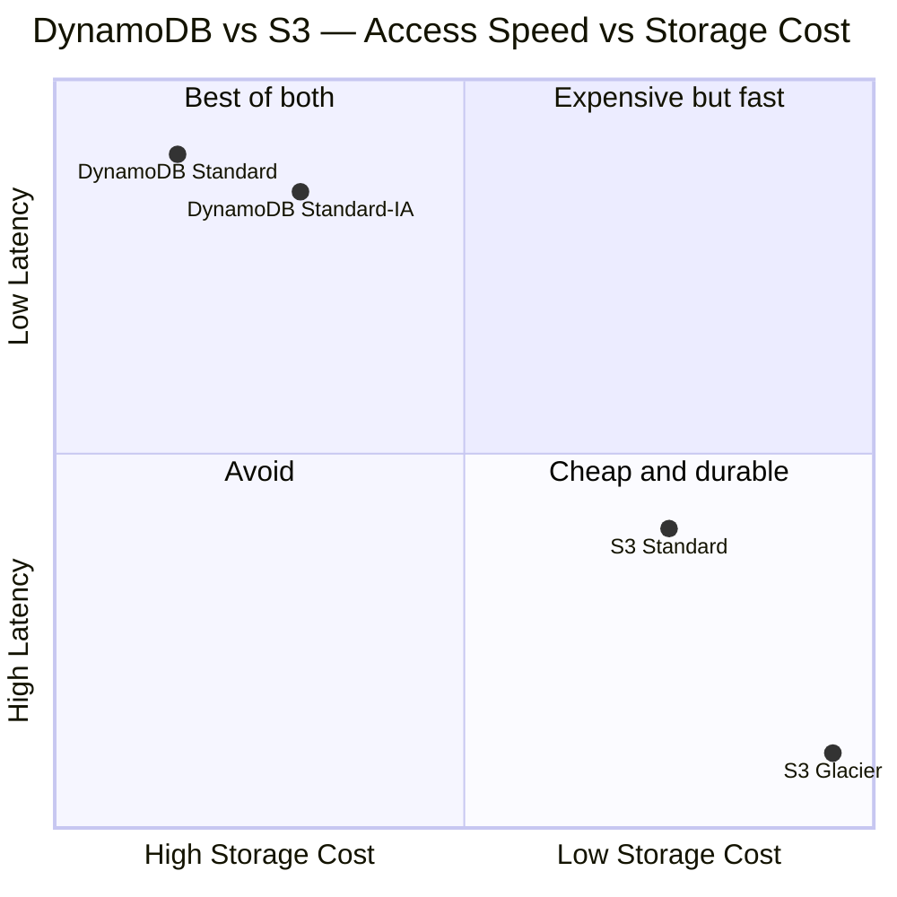

| Dimension | DynamoDB | S3 |
|---|---|---|
| **Primary abstraction** | Table → Items → Attributes | Bucket → Objects |
| **Query capability** | ✅ Rich (GSI, LSI, filters) | ❌ None (key lookup only) |
| **Latency** | ⚡ Single-digit ms | 🐢 Tens–hundreds of ms |
| **Cost model** | Per read/write unit | Per GB stored |
| **Max item/object size** | 400 KB per item | 5 TB per object |
| **Auto-scaling** | ✅ Provisioned or On-Demand | ✅ Unlimited objects |
| **Durability** | ✅ Multi-AZ replication | ✅ 11 nines |
| **CDN integration** | ❌ Not designed for it | ✅ Native with CloudFront |
| **Best on request path** | ✅ Yes | ⚠️ Possible but not ideal |
| **Best for large files** | ❌ 400KB limit | ✅ Up to 5TB |

---

## 7. Decision Guide

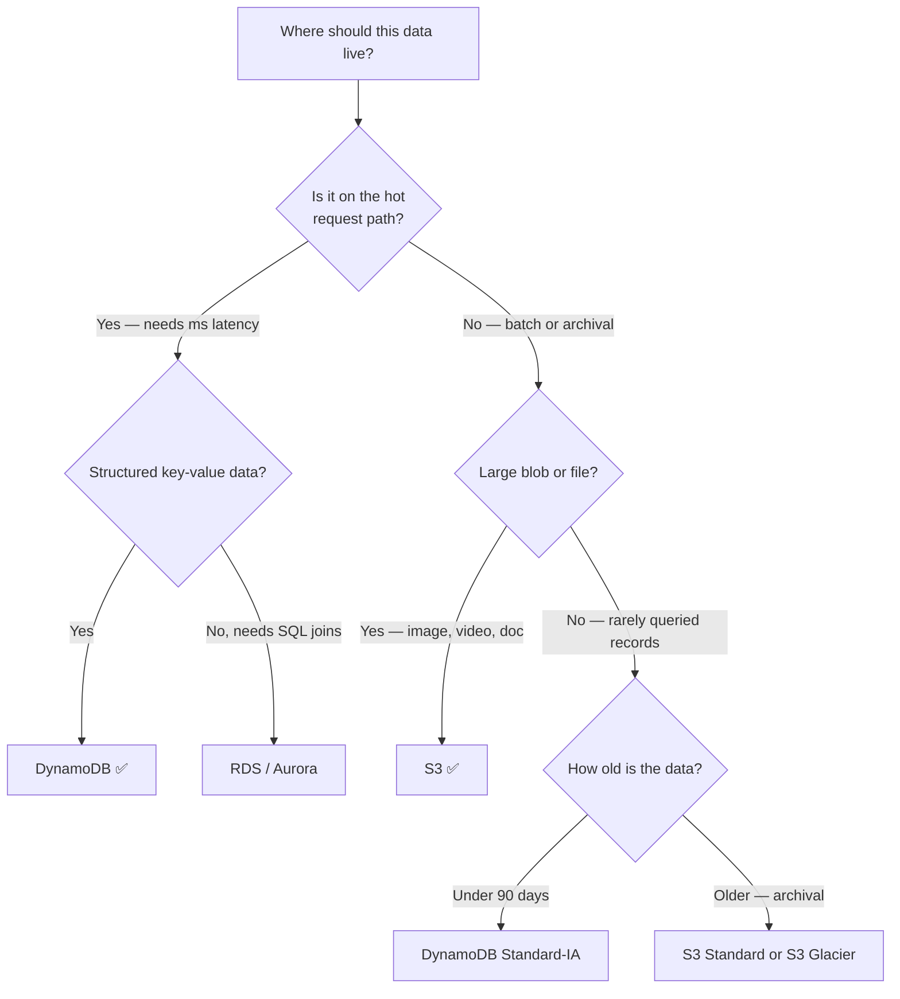

> 💡 **Rule of thumb:**
> - Data your app reads **per user request** → **DynamoDB**
> - Data that just needs to **exist reliably and cheaply** → **S3**
> - Data that **started hot but aged out** → migrate DynamoDB → S3

---

## 8. Quick Revision Cheatsheet

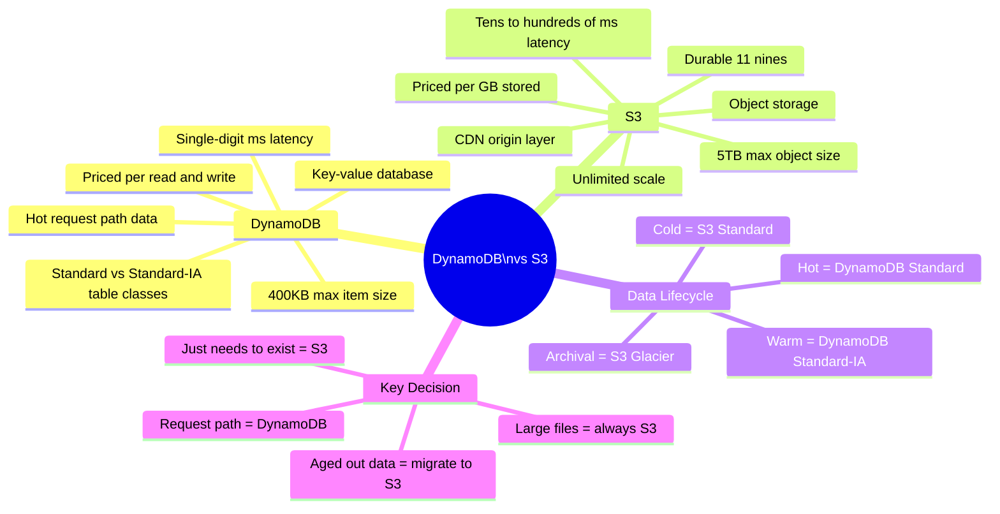

### ⚡ One-Liner Summaries

| Concept | One-Line Summary |
|---|---|
| **DynamoDB** | Key-value DB for ms-latency hot request path data — priced per read/write |
| **S3** | Object store for durable, cheap, scalable storage — priced per GB stored |
| **DynamoDB Standard-IA** | Same as Standard but cheaper storage, higher read cost — for cold table data |
| **S3 Glacier** | Cheapest long-term archive — retrieval takes minutes to hours |
| **Data lifecycle** | Hot → DynamoDB → DynamoDB-IA → S3 → S3 Glacier as data ages |
| **S3 + CDN** | S3 as origin + CloudFront = serve static assets at internet scale |
| **The real question** | Not DynamoDB vs S3 — it's *what phase of lifecycle is this data in?* |

---

> 📅 **Notes compiled from:** DynamoDB vs S3: Rethinking Where Data Should Live — Aasma Garg
