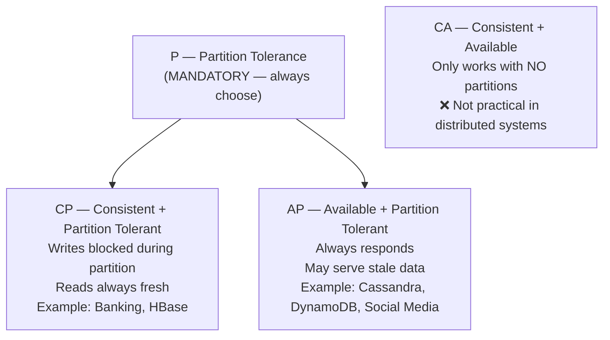
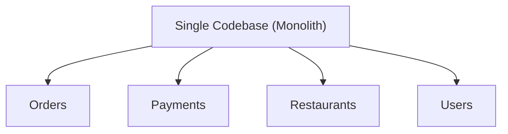
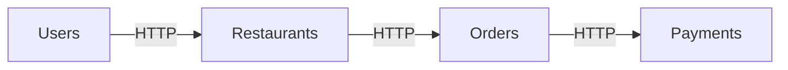
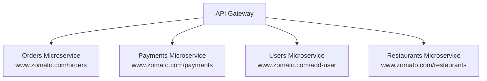
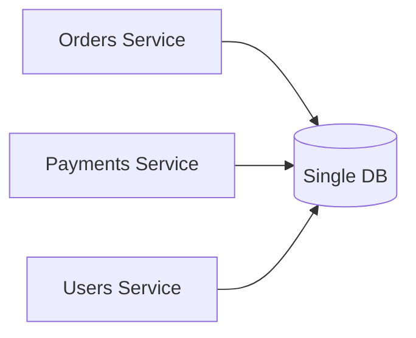
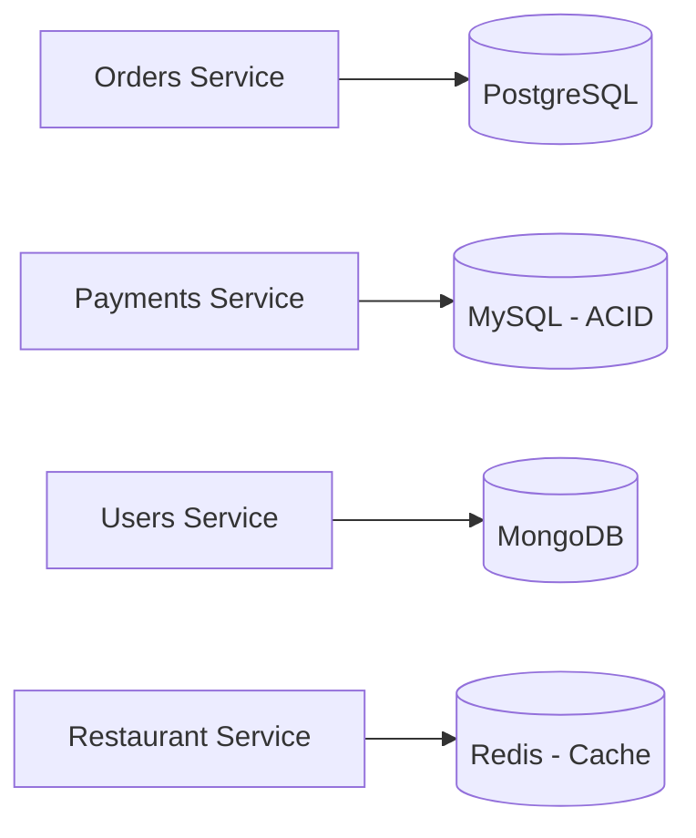
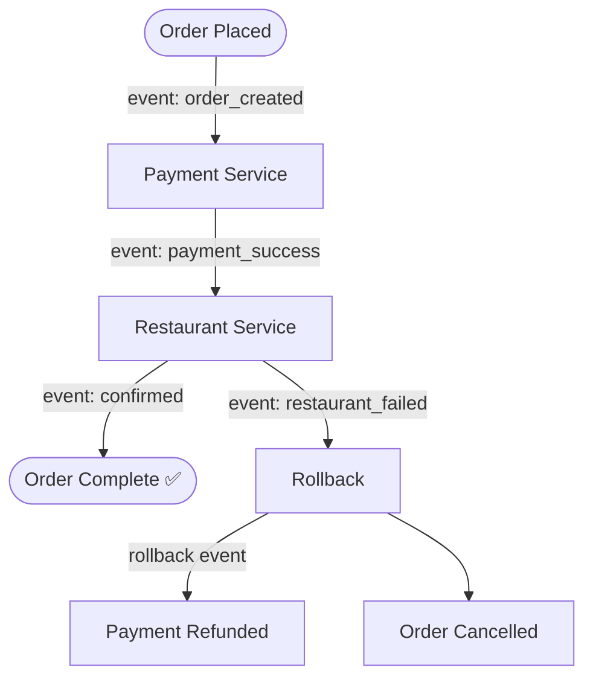
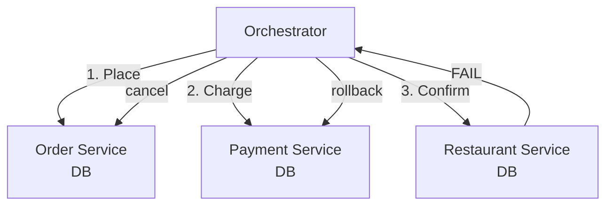
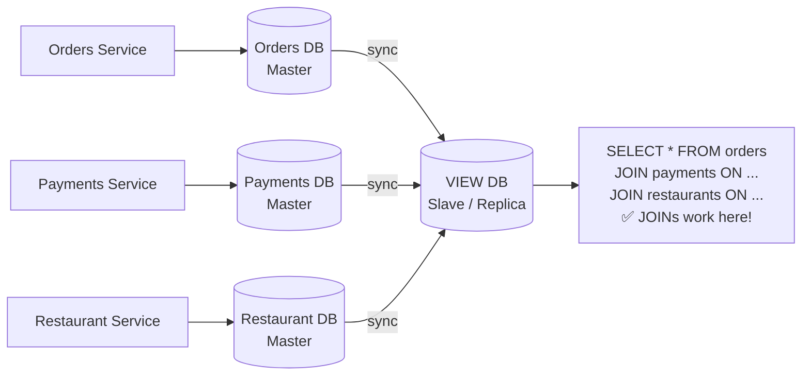

# HLD Master Notes — Lecture 3
### High Level Design: CAP Theorem · Back-of-Envelope · Monolith vs Microservice

---

## Table of Contents
1. [CAP Theorem](#1-cap-theorem)
2. [Availability Numbers](#2-availability-numbers)
3. [Back of the Envelope — Instagram](#3-back-of-the-envelope--instagram)
4. [Monolith vs Microservice](#4-monolith-vs-microservice)
5. [Decomposition Phase](#5-decomposition-phase)
6. [Strangler Pattern](#6-strangler-pattern)
7. [DB Phase](#7-db-phase)
8. [Communication: Choreography vs Orchestration](#8-communication-choreography-vs-orchestration)
9. [CQRS + Master-Slave Model](#9-cqrs--master-slave-model)

---

## 1. CAP Theorem

> **"In any distributed system, you can only guarantee 2 out of 3 properties."**

| Property | Full Form | Meaning |
|---|---|---|
| **C** | Consistency | Every client gets the **same data** at the same time, no matter which node (DB) responds |
| **A** | Availability | Every request **always gets a response** (may not be latest data) |
| **P** | Partition Tolerance | System keeps running even if **network between nodes breaks** |



### Consistency vs Availability (Plain English)
- **Consistency** → Response is **up-to-date, mandatory**. May block if nodes disagree.
- **Availability** → Response is **always given**, up-to-date is optional.

---

## 2. Availability Numbers

> How much downtime is acceptable per year?

| SLA | Downtime per year |
|---|---|
| 99% | ~3.65 days |
| 99.9% | ~8.77 hours |
| 99.99% | ~52 minutes |
| 99.999% | ~5 minutes ← Google, Amazon, Microsoft |

**More 9s = less downtime = higher engineering cost.**

---

## 3. Back of the Envelope — Instagram

> Rough estimation before designing a system. Tests if your architecture can handle scale.

### Power of 2 Reference
| Power | Value | Unit |
|---|---|---|
| 2^10 | Thousands | Kilobyte (KB) |
| 2^20 | Millions | Megabyte (MB) |
| 2^30 | Billions | Gigabyte (GB) |
| 2^40 | Trillions | Terabyte (TB) |
| 2^50 | Quadrillions | Petabyte (PB) |
| 2^60 | — | Exabyte (EB) |

### Assumptions
- Monthly Active Users: **~2 Billion**
- Daily Active Users (DAU): **60% of MAU = ~1.2 Billion**
- User checks feed **30 times/day** (average)
- User uploads **1 photo/reel per day** (average)
- Estimate for **5 years**

### QPS Calculations

```
Feed View QPS:
Daily feed requests = 1.2B × 30 = 36B requests/day
QPS = 36B / 86,400 sec ≈ 420,000 QPS
Peak QPS = 2 × 420K ≈ 840K/sec

Upload QPS:
Daily upload requests = 1.2B × 1 = 1.2B/day
QPS = 1.2B / 86,400 ≈ 14,000 QPS
Peak QPS = 2 × 14K ≈ 28K/sec
```

### Storage Calculations

```
Photos/day: 1.2B × 80% = ~1B photos × 1 MB = 1PB/day
Videos/day: 1.2B × 20% = 0.25B × 50MB ≈ 12PB/day
Total daily: 1PB + 12PB = 13PB/day
For 5 years: 13PB × 365 × 5 ≈ 24,000 PB ≈ 24 Exabytes
```

---

## 4. Monolith vs Microservice

### Monolith (e.g. Tomato app — early days)



| Pros | Cons |
|---|---|
| Fast (no network calls) | Hard to **scale** individual parts |
| Simple to build | **Heavy CI/CD** — entire app redeploys for 1 change |
| Easy local dev | **Debugging & testing** complex |

---

### Microservice (e.g. Zomato)



Each service:
- Has its **own codebase**
- Runs **independently**
- Communicates via **HTTP / Events**

| Pros | Cons |
|---|---|
| Independent deploy & scale | **Latency** (network hops) |
| Team autonomy | **Transaction management** hard |
| Tech freedom per service | **Multiple service JOIN** complex |

---

### 5 Phases of Microservice Migration

| Phase | What to decide |
|---|---|
| 1. **Decomposition** | How to break monolith into services |
| 2. **Database** | Shared DB or unique DB per service |
| 3. **Communication** | API calls or Event-driven |
| 4. **Deployment** | CI/CD pipeline per service |
| 5. **Observability** | Monitoring, logging, tracing |

---

## 5. Decomposition Phase

> How do you break a monolith into microservices?

### Pattern 1: Decomposition by Business Logic

Split by **what the code does** — Orders, Payments, Users, Restaurants each become a service.

**Disadvantage:** Every developer must understand the **entire business domain**.

---

### Pattern 2: Decomposition by Sub-domain ✅ (Recommended)



**Advantage:** Each team owns exactly **one domain**. Orders team only knows Orders.

---

## 6. Strangler Pattern

> "Don't migrate all 100 APIs at once — do it gradually."

Named after the **strangler fig tree** 🌳 — a vine that slowly wraps around and replaces the host tree.

```mermaid
gantt
    title Strangler Pattern Migration (Tomato App — 100 APIs)
    dateFormat X
    axisFormat Week %s

    section Monolith
    90 APIs on Monolith    :0, 3
    60 APIs on Monolith    :2, 5
    0 APIs on Monolith     :5, 6

    section Microservices
    /orders - 10 APIs moved  :0, 2
    /payments migrated       :2, 4
    100% migrated ✅         :4, 6
```



**Both systems run in parallel during migration.** Zero downtime approach.

---

## 7. DB Phase

> Each microservice can have: (1) Shared DB, or (2) Unique DB

### Option A — Shared DB ❌



| Pros | Cons |
|---|---|
| Easy JOINs (SQL) | **Cannot scale** independently |
| Simple transactions (ACID) | One DB type for everyone |
| Familiar | Schema change breaks all services |

---

### Option B — Unique DB per service ✅ (Recommended — Polyglot Persistence)



**This is called "Polyglot Persistence"** — use the **right DB for the right job.**

| Service | Best DB | Why |
|---|---|---|
| Orders | PostgreSQL | Structured, relational |
| Payments | MySQL | ACID transactions |
| Users | MongoDB | Flexible schema |
| Menu/Cache | Redis | Ultra-fast reads |

**Disadvantage:** JOINs across services are impossible → solved by **CQRS** (see section 9).

---

## 8. Communication: Choreography vs Orchestration

> When services need to coordinate, how do they talk?

---

### Choreography (Event Driven) 📡

**No central controller.** Each service publishes events and listens to others.



| Pros | Cons |
|---|---|
| Loose coupling | **Very complex to build** |
| No single point of failure | Hard to debug (no central view) |
| Scales well | Rollback logic spread across services |

---

### Orchestration (SAGA Pattern) 🎻

**One central Orchestrator** controls the flow via API calls.



| Pros | Cons |
|---|---|
| **Central visibility** — easy to debug | **Single point of failure** |
| Explicit rollback logic | Orchestrator can become very large |
| Simple to reason about flow | Tight coupling to orchestrator |

---

## 9. CQRS + Master-Slave Model

> **Problem:** With separate DBs per service, SQL JOIN across services is impossible.
> **Solution:** CQRS — separate your read and write paths.

### CQRS = Command Query Responsibility Segregation

| Type | Operations | Where |
|---|---|---|
| **COMMAND** | INSERT, UPDATE, DELETE | Each service's own DB (Master) |
| **QUERY** | SELECT, JOIN | Shared View DB (Slave/Replica) |

### Master-Slave Architecture



### How it works:
- **Masters** handle all write operations (one per service)
- **Slave/View DB** is a **read-only replica** — synced from all masters
- All complex **READ queries and JOINs** go to the View DB

| | Without CQRS | With CQRS |
|---|---|---|
| JOIN across services | ❌ Impossible | ✅ Easy via View DB |
| Write scalability | ❌ One DB bottleneck | ✅ Each service scales independently |
| Read scalability | ❌ Single DB load | ✅ Slave handles all reads |

---

## Quick Revision Cheatsheet

```
CAP Theorem      → Pick 2 of 3. P is mandatory. Choose C or A.
Availability     → More 9s = less downtime (99.999% = 5 min/year)
Back of Envelope → DAU × requests × size = QPS & storage estimate
Monolith         → Fast, simple, but hard to scale
Microservice     → Scalable, independent, but complex
Decomposition    → By Business Logic or Sub-domain (subdomain better)
Strangler        → Migrate gradually, route by route, not all at once
DB Phase         → Unique DB per service (Polyglot Persistence)
Choreography     → Event-driven, no boss, complex rollback
Orchestration    → Central boss (SAGA), explicit rollback, easier debug
CQRS             → COMMAND writes to master, QUERY reads from slave View DB
```

---

*Notes compiled from HLD Lecture 3 — Microservice Architecture Series*
