# 🗄️ HLD Lecture 15 — SQL Architecture Deep Dive

> **From raw rows to blazing-fast queries — understanding the full stack of relational databases**

---

## 📑 Table of Contents

1. [SQL / Relational Architecture](#1-sql--relational-architecture)
2. [Data Storage Internals](#2-data-storage-internals)
3. [Master-Slave Architecture](#3-master-slave-architecture)
4. [Horizontal Scaling → Sharding](#4-horizontal-scaling--sharding)
5. [Indexing Basics](#5-indexing-basics)
6. [B-Trees](#6-b-trees)
7. [B+ Trees](#7-b-trees-1)
8. [Clustered vs Non-Clustered Indexing](#8-clustered-vs-non-clustered-indexing)
9. [NoSQL Comparison](#9-nosql-comparison)
10. [Quick Summary Cheatsheet](#10-quick-summary-cheatsheet)

---

## 1. SQL / Relational Architecture

### 🏗️ What is a Relational Database?

A **Relational Database** organizes data into **rows and columns** (just like an Excel sheet, but way more powerful). It is a **logical arrangement** — the table you see in a query is **not** physically stored that way on disk.

```
📋 Logical Layer  → What you SEE (Tables, Views, Rows, Columns)
💾 Physical Layer → What's on DISK (Sectors, Data Blocks, Data Pages)
```

### 🍕 Real-World Analogy: Restaurant Order System

| userId | name   | email       |
|--------|--------|-------------|
| 101    | Aditya | xyz@mail.com |
| 102    | Rohit  | ert@mail.com |
| 103    | Mukesh | wer@mail.com |

Think of this table like a **restaurant's order book**:
- Each **row** = one customer's order
- Each **column** = a specific detail (name, table number, food item)
- The **DBMS** is the waiter who finds your order when you call

### 🔭 Views → Virtual Tables

```sql
-- A VIEW is like a filtered window into your data
CREATE VIEW active_users AS
  SELECT userId, name FROM user WHERE active = 1;
-- No data is actually duplicated — it's just a saved query!
```

> 💡 **Think of Views** like a Snapchat filter — the original face (data) is unchanged, but you see a custom version.

---

## 2. Data Storage Internals

### 🧱 The Physical Storage Hierarchy

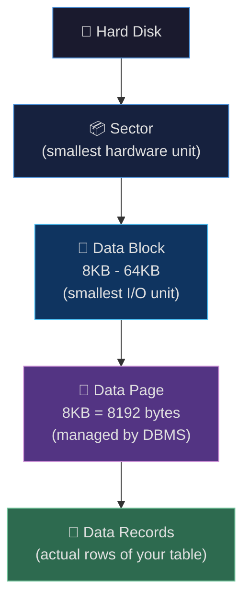

### 📄 Anatomy of a Data Page

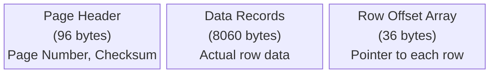

```
┌─────────────────────────────────────────────┐
│           DATA PAGE  (8 KB = 8192 bytes)    │
├──────────────┬──────────────────┬───────────┤
│ Page Header  │   Data Records   │  Offset   │
│   96 bytes   │   8060 bytes     │ 36 bytes  │
│ (page no,    │ (your actual     │ (array of │
│  checksum)   │  row data)       │  row ptrs)│
└──────────────┴──────────────────┴───────────┘
```

### 🔢 Real-World Math Breakdown

Imagine a **User table with 1 Million rows**:

| Parameter | Value | Explanation |
|-----------|-------|-------------|
| 1 Data Page | 8 KB = 8192 bytes | Standard SQL Server page size |
| Page Header | 96 bytes | Overhead for page metadata |
| Usable space | 8060 bytes | For actual row data |
| Row offset | 36 bytes | Fixed overhead per page |
| Avg row size | **32 bytes** | userId(4) + name(16) + email(12) |
| Rows per page | **~251 rows** | 8060 / 32 ≈ 251 |
| Total pages needed | **~3,984 pages** | 1,000,000 / 251 |
| Total data blocks | **~1,992 blocks** | 3,984 / 2 (2 pages per 8KB block) |

### 🗺️ DBMS Mapping Table

The DBMS keeps a **mapping table** to know which data page lives in which data block:

```
DBMS Mapping Table:
├── Data page 1    ──►  Data Block 1
├── Data page 2    ──►  Data Block 1
├── Data page 3    ──►  Data Block 2
│   ...
└── Data page 3984 ──►  Data Block 1992
```

### 🐌 The Performance Problem (Without Indexing)

```sql
SELECT * FROM user WHERE userId = 101;
```

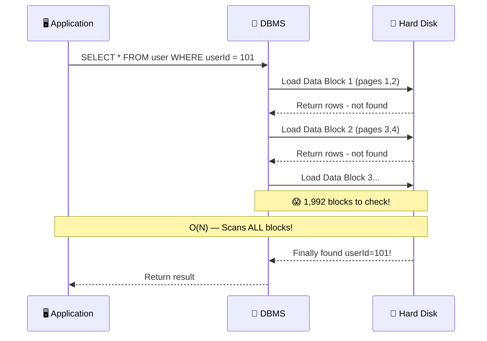

> ⚠️ **The Problem**: Without indexing, every query does a **Full Table Scan** — O(N) complexity. With 10 million rows, this reads millions of data blocks!

---

## 3. Master-Slave Architecture

### 🎯 The Problem It Solves

Your app grows. Suddenly you have **millions of users** hitting your DB. A single database server **can't handle it all**!

### 🏛️ Solution: Master-Slave (Primary-Replica)

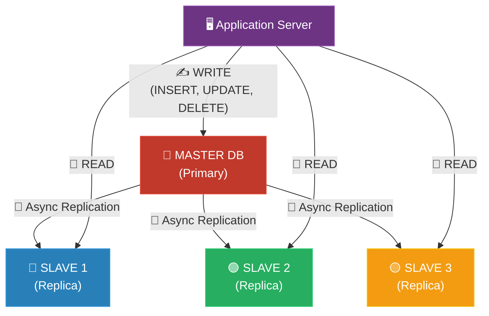

### 📋 Master vs Slave — Quick Rules

| Feature | Master (Primary) | Slave (Replica) |
|---------|-----------------|-----------------|
| **Writes** | ✅ Yes | ❌ No |
| **Reads** | ✅ Yes (avoid) | ✅ Yes (preferred) |
| **Count** | 1 per cluster | Multiple |
| **Failover** | Promoted from slave | Promoted to master |
| **Purpose** | Handle all writes | Scale reads horizontally |

### 🍎 Real-World: Netflix

> Netflix uses **Master-Slave** for its user preference data. When you pause a show, the **master** gets the write. When 80 million users browse the homepage simultaneously, **read replicas** serve all those catalogue reads — the master is untouched.

---

## 4. Horizontal Scaling → Sharding

### 🤔 Master-Slave isn't enough

What if your **write load** itself becomes too heavy? You can't have more than one master in basic replication. Enter: **Sharding**!

### 🧩 Sharding: Split the Data Across Multiple DBs

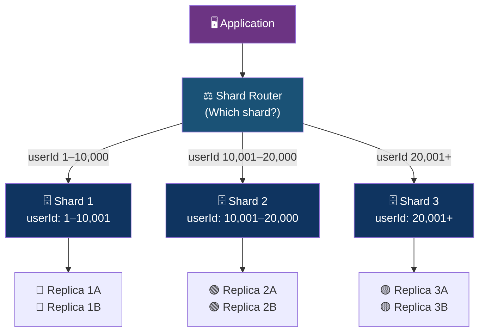

### 🍕 Pizza Analogy

> You're running a **pizza chain**. One store (master) can't serve all of Mumbai. So you open **3 stores** (shards):
> - **Shard 1**: Customers in Andheri → orders go to Andheri store
> - **Shard 2**: Customers in Bandra → orders go to Bandra store
> - **Shard 3**: Customers in Powai → orders go to Powai store

Each store is independent — horizontal scaling!

---

## 5. Indexing Basics

### 🐢 The Problem

```sql
-- 10 million users, no index:
SELECT * FROM user WHERE userId = 5000000;
-- Scans ALL 3,984+ pages = SLOW 🐌
```

Without indexing → **O(N)** — reads every single data block.

### 🚀 The Solution: Indexing

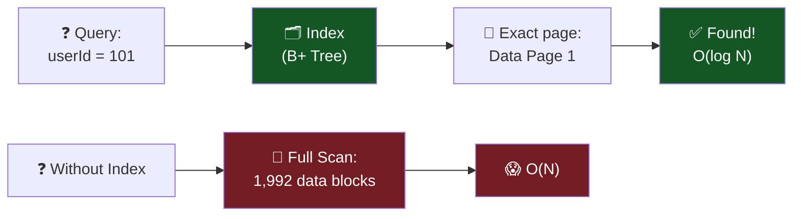

| Without Index | With Index |
|--------------|-----------|
| O(N) | O(log N) |
| Scans all blocks | Jumps directly to page |
| Slow on large tables | Fast even at 100M rows |
| Full table scan | Index seek |

### 🗂️ Types of Indexing

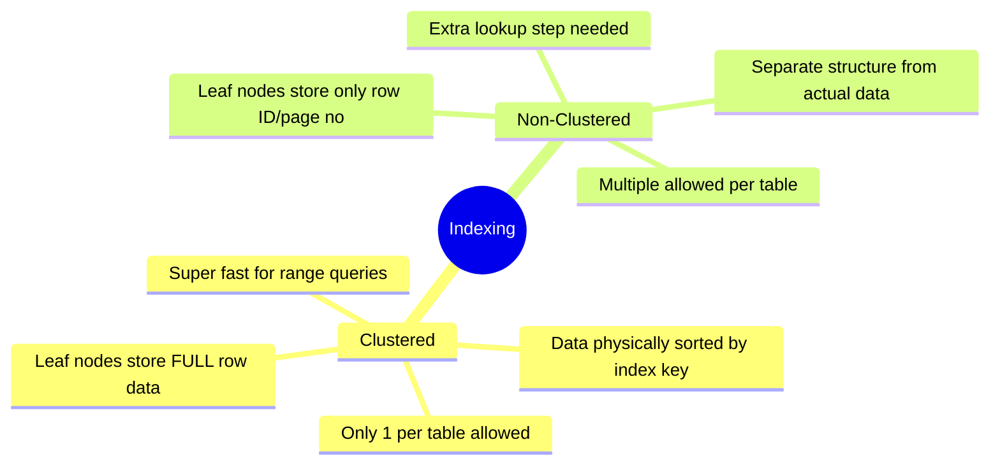

---

## 6. B-Trees

### 🌳 The DSA Behind Indexing

Before B-Trees, let's understand the evolution:

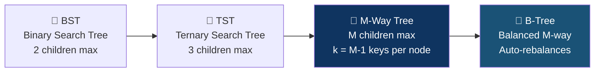

### 🔵 B-Tree Structure (M = 3)

Rules for a B-Tree with **order M = 3**:
- Each node has **at most M children** = 3
- Each node has **at most M-1 keys** = 2 keys
- The tree is **always balanced** (auto-rebalances on insert)

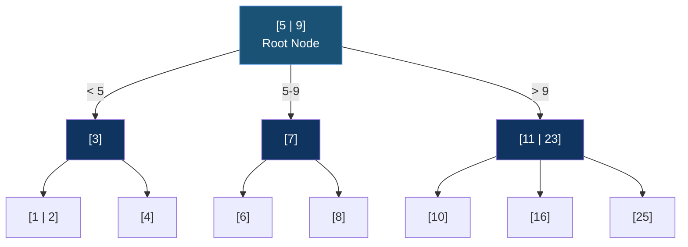

### 🔄 B-Tree Split (Insertion Process)

When inserting **9, 11, 7, 3, 10, 23, 5, 16, 12, 34, 1, 89**:

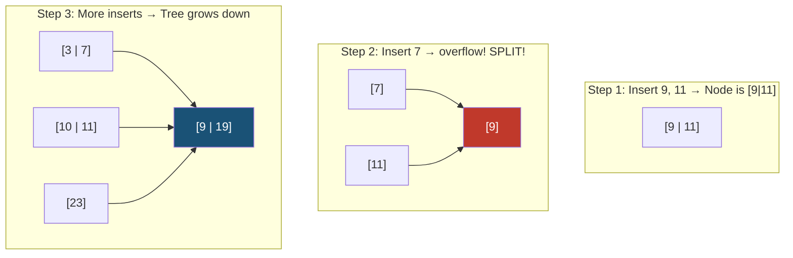

### 💾 B-Tree Node Code Structure

```c
struct BTreeNode {
    int keys[M-1];         // e.g., [5, 9] for M=3
    BTreeNode* children[M]; // pointers to children
    int keyCount;           // current number of keys
    bool isLeaf;
};
```

---

## 7. B+ Trees

### 🌟 Why B+ Trees? The Upgrade from B-Trees

B-Trees are good, but **databases specifically use B+ Trees** for a key reason:

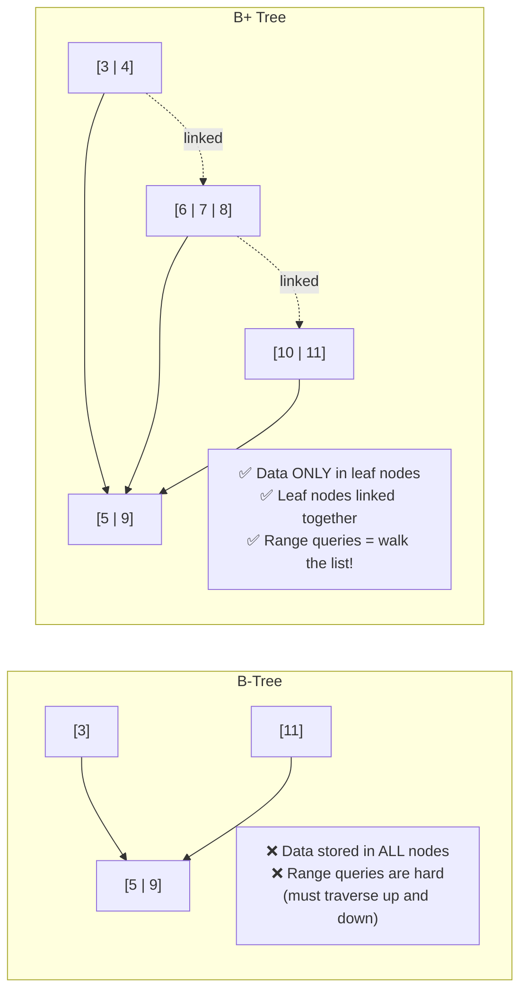

### 🔑 Key Differences: B-Tree vs B+ Tree

| Feature | B-Tree | B+ Tree |
|---------|--------|---------|
| Data location | All nodes | **Leaf nodes only** |
| Intermediate nodes | Store data + keys | Store keys only (as guides) |
| Leaf node links | ❌ Not linked | ✅ **Linked list** |
| Range queries | Slow (backtrack) | **Fast** (traverse leaf list) |
| Used in DBs | Rarely | **YES — default** |

### 🔵 B+ Tree Visual

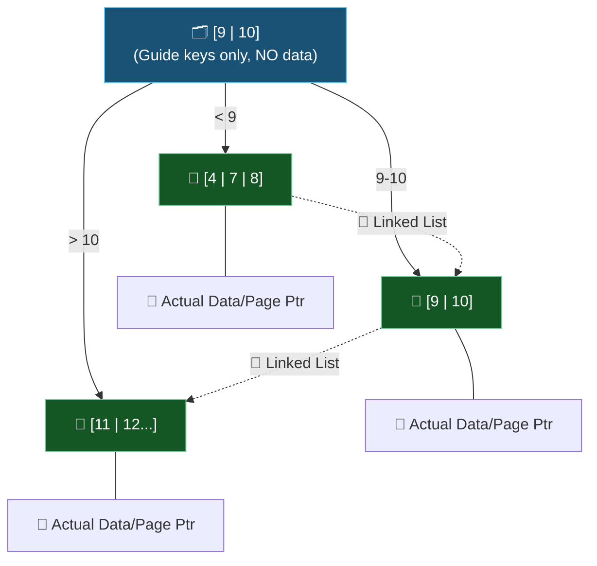

### ⚡ Range Query Power

```sql
-- Range query: userId between 101 and 205
SELECT * FROM user WHERE userId BETWEEN 101 AND 205;
```

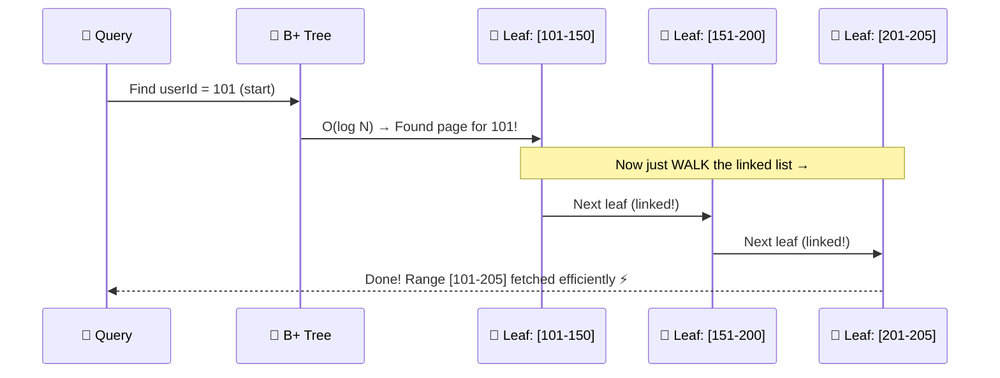

> 🎯 **B+ Tree is perfect for range queries** because leaf nodes form a doubly-linked list — no tree traversal needed after finding the start!

---

## 8. Clustered vs Non-Clustered Indexing

### 🏠 Clustered Index — The "Living Together" Index

> 🏠 **Analogy**: In a Clustered Index, the data IS the index. Think of a **physical library** where books are arranged alphabetically ON THE SHELF. The arrangement IS the index!

```mermaid
graph TD
    subgraph CI["🟢 Clustered Index (B+ Tree)"]
        CRoot["Root: [19 | 25]"]
        CL1["[1 | 6]"] --> CRoot
        CL2["[17 | 19]"] --> CRoot
        CL3["[25 | 30]"] --> CRoot

        CL1 -->|"Full row data!"| CD1["📄 Page 1\n1, Alice, alice@mail.com\n6, Bob, bob@mail.com"]
        CL2 -->|"Full row data!"| CD2["📄 Page 2\n17, Charlie, c@mail.com\n19, Aditya, xyz@mail.com"]
        CL3 -->|"Full row data!"| CD3["📄 Page 3\n25, Rohit, ert@mail.com\n30, Mukesh, wer@mail.com"]

        CD1 -.->|"linked"| CD2 -.->|"linked"| CD3
    end

    style CI fill:#0d1b0d,stroke:#74c69d
    style CD1 fill:#155724,color:#fff
    style CD2 fill:#155724,color:#fff
    style CD3 fill:#155724,color:#fff
```

### 📑 Non-Clustered Index — The "Lookup Table" Index

> 📑 **Analogy**: Non-Clustered Index is like the **index at the back of a textbook** — it tells you "B+ Trees → see page 47" but the actual content is on page 47, not in the index itself.

```mermaid
graph TD
    subgraph NCI["🔵 Non-Clustered Index (B+ Tree on 'name')"]
        NRoot["Root: [M | R]"]
        NL1["[Aditya | Bob]"] --> NRoot
        NL2["[Mukesh | Nita]"] --> NRoot
        NL3["[Rohit | Zara]"] --> NRoot

        NL1 -->|"Only page number!"| ND1["📋 Aditya → Page 2, Row 4\nBob → Page 1, Row 2"]
        NL2 -->|"Only page number!"| ND2["📋 Mukesh → Page 3, Row 2\nNita → Page 5, Row 1"]
        NL3 -->|"Only page number!"| ND3["📋 Rohit → Page 3, Row 1\nZara → Page 8, Row 7"]
    end

    subgraph Extra["Extra lookup step needed!"]
        ND1 -->|"Go to actual page"| ACTUAL["📄 Actual Data Pages\n(Full row data lives here)"]
        ND2 --> ACTUAL
        ND3 --> ACTUAL
    end

    style NCI fill:#1a0d1a,stroke:#ce93d8
    style ND1 fill:#6c3483,color:#fff
    style ND2 fill:#6c3483,color:#fff
    style ND3 fill:#6c3483,color:#fff
    style ACTUAL fill:#1a5276,color:#fff
```

### ⚔️ Head-to-Head Comparison

| Feature | 🟢 Clustered Index | 🔵 Non-Clustered Index |
|---------|-------------------|----------------------|
| **Leaf nodes store** | **Full row data** | **Only page number / row ID** |
| **Count per table** | **Only 1** (data can only be sorted one way!) | **Multiple** (each on diff column) |
| **Speed (exact lookup)** | ⚡ Very fast | 🔄 Fast (extra pointer hop) |
| **Range queries** | ⚡⚡ Extremely fast | Slower (many pointer hops) |
| **INSERT speed** | 🐢 Slower (must maintain order) | Faster |
| **Storage** | Base table IS the index | Extra storage required |
| **Default for PK** | ✅ Yes (auto-created) | ❌ No |

### 🚨 Why Not Index Every Column?


### 🎯 Real-World: Which Columns to Index?

| Column | Index? | Why? |
|--------|--------|------|
| `userId` (Primary Key) | ✅ Auto clustered | Unique, frequently queried |
| `email` | ✅ Non-clustered | Login queries need fast lookup |
| `name` | ⚠️ Maybe | Depends on search frequency |
| `created_at` | ✅ Non-clustered | Range queries (date filters) |
| `gender` | ❌ No | Low cardinality (only M/F) — bad index |
| `bio_text` | ❌ No | Full-text search needed instead |

---

## 9. NoSQL Comparison

### 🗄️ How Different NoSQL DBs Handle Indexing

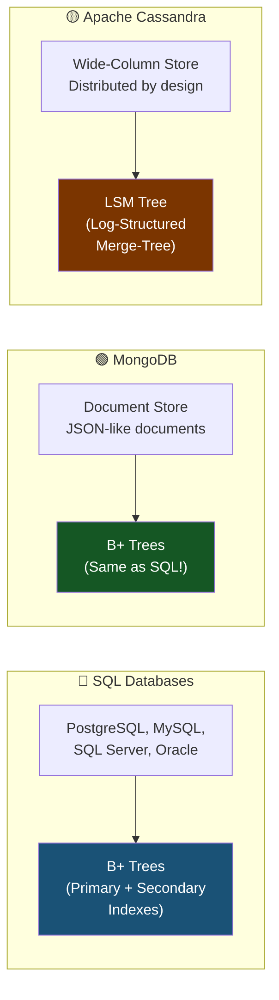

### 🌲 What is an LSM Tree? (Cassandra's Secret Weapon)

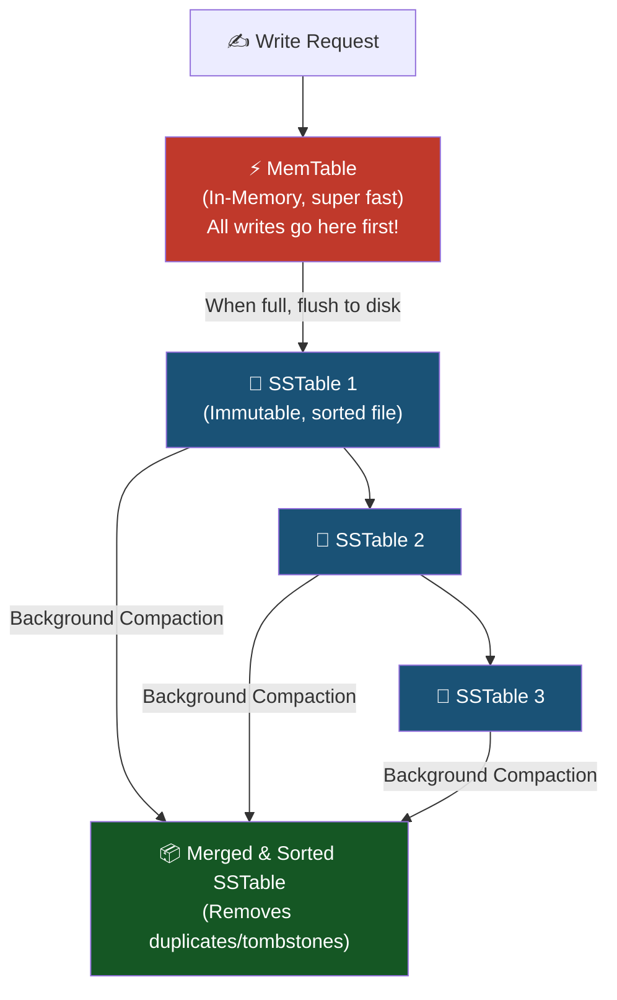

### ⚔️ B+ Tree vs LSM Tree

| Feature | B+ Tree (SQL, MongoDB) | LSM Tree (Cassandra) |
|---------|----------------------|---------------------|
| **Write speed** | 🔄 Moderate (update in-place) | ⚡ **Super fast** (append-only) |
| **Read speed** | ⚡ **Super fast** | 🔄 Moderate (check multiple files) |
| **Range queries** | ⚡ Excellent | 🔄 Good (after compaction) |
| **Best for** | Read-heavy workloads | Write-heavy workloads |
| **Space efficiency** | Good | Lower (until compaction) |
| **Real-world use** | E-commerce, Banking | IoT, Logging, Analytics |

### 🏢 Real-World Scenario

| Use Case | Recommended DB | Why |
|----------|---------------|-----|
| 🏦 Banking / Payments | PostgreSQL (B+ Tree) | Consistency + fast reads |
| 📱 Social Media Feed | MongoDB (B+ Tree) | Flexible schema + reads |
| 📊 IoT Sensor Data | Cassandra (LSM Tree) | 1M+ writes/sec |
| 🛒 E-commerce Catalog | MySQL (B+ Tree) | Complex queries + joins |
| 📝 Logging Pipeline | Cassandra / ClickHouse | Append-heavy writes |

---

## 10. Quick Summary Cheatsheet

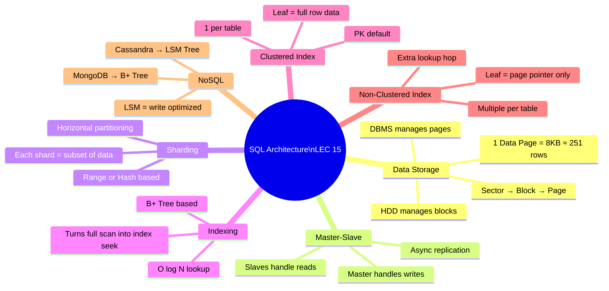

---

### 🏁 The Big Picture

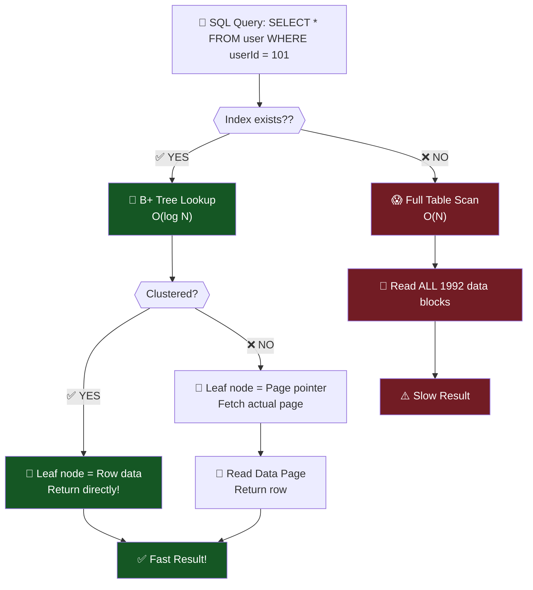

---

## 📚 References

- **HLD Lecture 15** — SQL Architecture, Data Storage, Indexing, B-Trees, B+ Trees
- SQL Server Documentation — Data Page Structure
- Carnegie Mellon DB Course — B+ Tree Internals
- Martin Kleppmann — *Designing Data-Intensive Applications*

---

*Made with 💙 for the HLD System Design Series*
