# 📚 HLD System Design Notes

> **Topics:** Fanout (Push vs Pull) · Cache Strategies · Idempotency in APIs · DB Hotspot & Salting · DynamoDB vs S3

---

## 📖 Table of Contents

1. [Fanout at Scale — Push vs Pull](#1-fanout-at-scale--push-vs-pull)
2. [Cache Strategies](#2-cache-strategies)
3. [Idempotency in API Design](#3-idempotency-in-api-design)
4. [Database Hotspot & Salting](#4-database-hotspot--salting)
5. [DynamoDB vs S3 — Where Should Data Live?](#5-dynamodb-vs-s3--where-should-data-live)
6. [Quick Revision Cheatsheet](#6-quick-revision-cheatsheet)

---

## 1. Fanout at Scale — Push vs Pull

> **Core Problem:** One event (e.g. a post) needs to reach millions of consumers.  
> How do you deliver it efficiently?

### 1.1 The Core Question

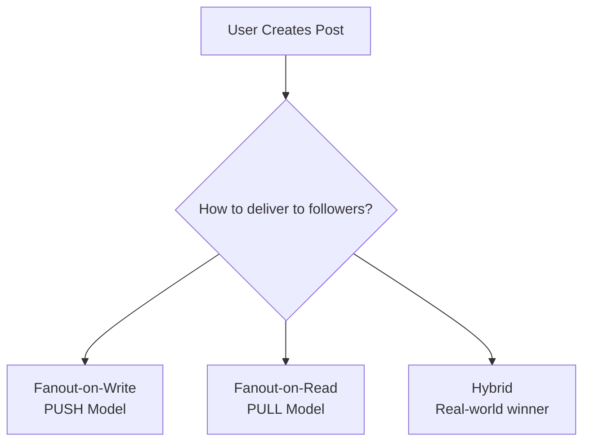
```mermaid
graph TD
    E[User Creates Post] --> Q{How to deliver to followers?}
    Q --> A[Fanout-on-Write\nPUSH Model]
    Q --> B[Fanout-on-Read\nPULL Model]
    Q --> C[Hybrid\nReal-world winner]
```

---

### 1.2 Fanout-on-Write — Push Model

> Write once → immediately push to every follower's feed.

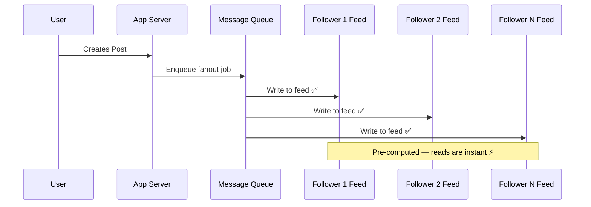
```mermaid
sequenceDiagram
    participant U as User
    participant S as App Server
    participant Q as Message Queue
    participant F1 as Follower 1 Feed
    participant F2 as Follower 2 Feed
    participant FN as Follower N Feed

    U->>S: Creates Post
    S->>Q: Enqueue fanout job
    Q->>F1: Write to feed ✅
    Q->>F2: Write to feed ✅
    Q->>FN: Write to feed ✅
    Note over F1,FN: Pre-computed — reads are instant ⚡
```

| ✅ Pros | ❌ Cons |
|---|---|
| Ultra-fast reads (just a lookup) | Massive write amplification |
| Predictable low latency | Heavy storage usage |
| Simple read queries | Celebrity with 100M followers = 100M writes per post |
| Great when reads >> writes | Hot users can crash the system |

> ⚠️ **Celebrity Problem:** 1 post × 100M followers = 100M DB writes. This is an operational nightmare.

---

### 1.3 Fanout-on-Read — Pull Model

> Store content once. When a user opens their feed → fetch & merge from followed accounts in real-time.

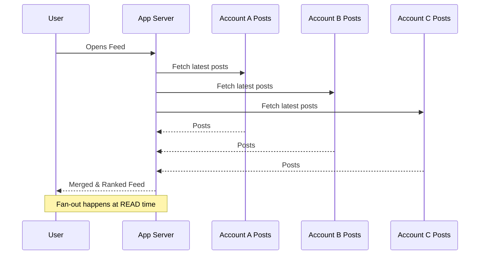
```mermaid
sequenceDiagram
    participant U as User
    participant S as App Server
    participant DB1 as Account A Posts
    participant DB2 as Account B Posts
    participant DB3 as Account C Posts

    U->>S: Opens Feed
    S->>DB1: Fetch latest posts
    S->>DB2: Fetch latest posts
    S->>DB3: Fetch latest posts
    DB1-->>S: Posts
    DB2-->>S: Posts
    DB3-->>S: Posts
    S-->>U: Merged & Ranked Feed
    Note over S,U: Fan-out happens at READ time
```

| ✅ Pros | ❌ Cons |
|---|---|
| Minimal write cost | Complex & expensive reads |
| Scales safely for celebrities | Higher read latency |
| Storage efficient | Hard to cache effectively |
| Handles unbounded fanout | Ranking on every request |

---

### 1.4 Hybrid Fanout — Real-World Solution

> Almost no large platform uses pure push or pull — they use **Hybrids**.

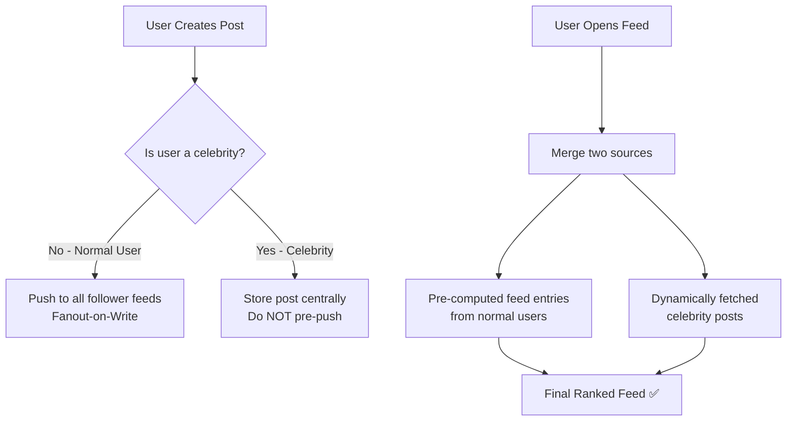
```mermaid
flowchart TD
    P[User Creates Post] --> C{Is user a celebrity?}
    C -->|No - Normal User| PUSH[Push to all follower feeds\nFanout-on-Write]
    C -->|Yes - Celebrity| STORE[Store post centrally\nDo NOT pre-push]

    R[User Opens Feed] --> MIX[Merge two sources]
    MIX --> PRE[Pre-computed feed entries\nfrom normal users]
    MIX --> DYN[Dynamically fetched\ncelebrity posts]
    PRE --> FINAL[Final Ranked Feed ✅]
    DYN --> FINAL
```

---

### 1.5 How Major Platforms Handle Fanout

| Platform | Strategy | Why |
|---|---|---|
| 🐦 Twitter/X | Push for normal users, Pull for celebrities | Top 0.01% would melt storage with push — called **Selective Fanout** |
| 📘 Facebook | Fanout-on-Write with async workers | Prioritises low-latency scrolling; uses backpressure + partial fanout |
| 📸 Instagram | Push + Pull hybrid | Ads/Reels/suggested content fetched dynamically |
| 💼 LinkedIn | Mostly Fanout-on-Write | Professional graph is smaller and denser — easier to precompute |
| 🎵 TikTok | Fanout-on-Read | Interest-based, not follower-based — impossible with push |

---

### 1.6 Fanout Beyond Social Media

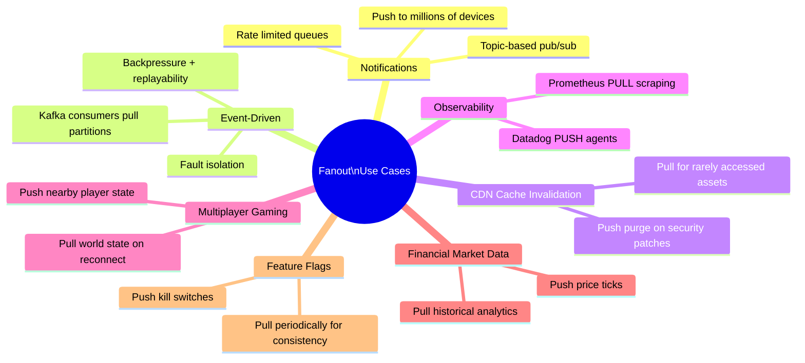
```mermaid
mindmap
  root((Fanout\nUse Cases))
    Notifications
      Push to millions of devices
      Topic-based pub/sub
      Rate limited queues
    Event-Driven
      Kafka consumers pull partitions
      Backpressure + replayability
      Fault isolation
    CDN Cache Invalidation
      Push purge on security patches
      Pull for rarely accessed assets
    Observability
      Prometheus PULL scraping
      Datadog PUSH agents
    Multiplayer Gaming
      Push nearby player state
      Pull world state on reconnect
    Financial Market Data
      Push price ticks
      Pull historical analytics
    Feature Flags
      Push kill switches
      Pull periodically for consistency
```

---

### 1.7 Decision Guide

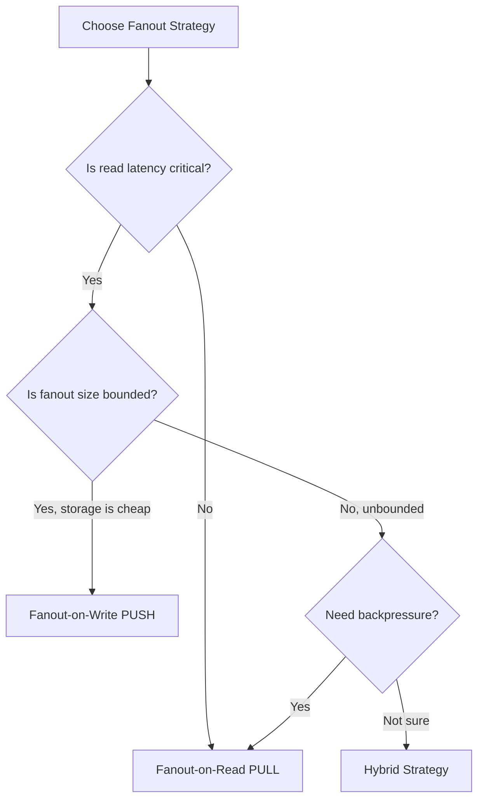
```mermaid
flowchart TD
    A[Choose Fanout Strategy] --> B{Is read latency critical?}
    B -->|Yes| C{Is fanout size bounded?}
    B -->|No| D[Fanout-on-Read PULL]
    C -->|Yes, storage is cheap| E[Fanout-on-Write PUSH]
    C -->|No, unbounded| F{Need backpressure?}
    F -->|Yes| D
    F -->|Not sure| G[Hybrid Strategy]
```

> 💡 **Mental Model:**
> - **Push = Home Delivery** → fast, expensive, predictable
> - **Pull = Warehouse Pickup** → cheap, flexible, slower
> - **Hybrid = Amazon Prime** 😄

---

## 2. Cache Strategies

> **Core Idea:** Store frequently accessed data temporarily so you avoid hitting the database every time.

### 2.1 Cache Types

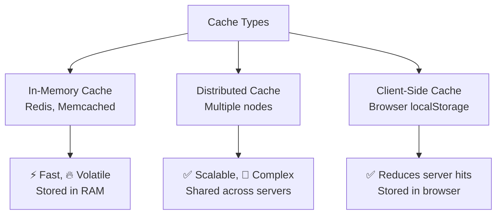
```mermaid
graph TD
    CT[Cache Types] --> IM[In-Memory Cache\nRedis, Memcached]
    CT --> DC[Distributed Cache\nMultiple nodes]
    CT --> CC[Client-Side Cache\nBrowser localStorage]

    IM --> IM2["⚡ Fast, 🔥 Volatile\nStored in RAM"]
    DC --> DC2["✅ Scalable, 🤔 Complex\nShared across servers"]
    CC --> CC2["✅ Reduces server hits\nStored in browser"]
```

> ⚠️ **Note:** In-memory cache is volatile — data lost on restart. In microservices with multiple instances, each has its own cache, so data may differ across instances.

---

### 2.2 Cache-Aside (Lazy Loading)

> App manages the cache. Check cache first → on miss, load from DB → store in cache.

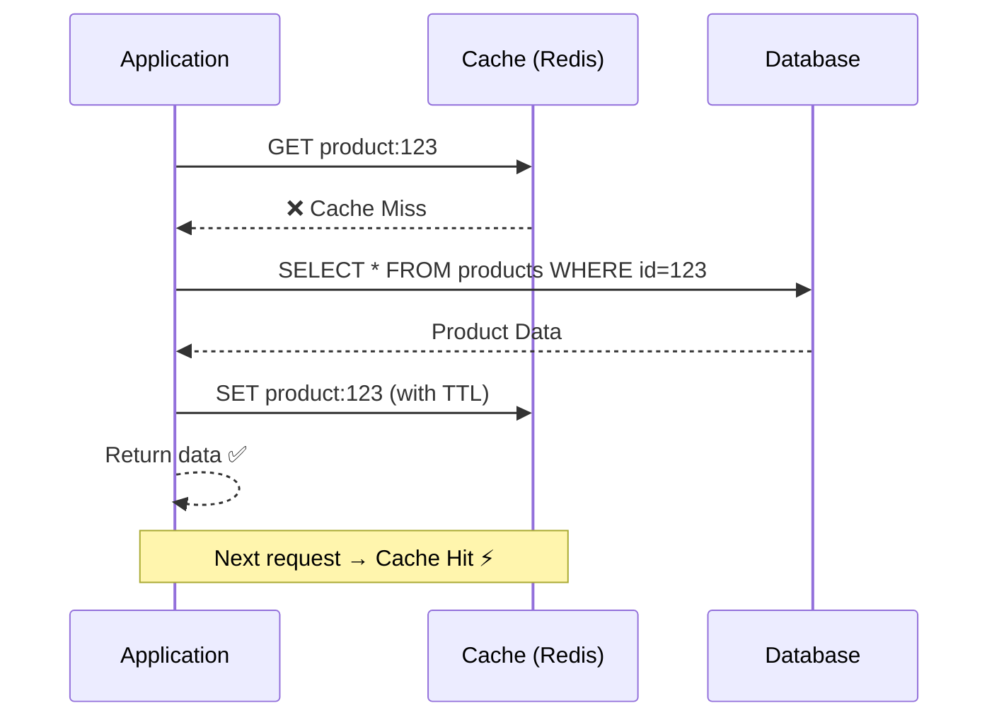
```mermaid
sequenceDiagram
    participant App as Application
    participant Cache as Cache (Redis)
    participant DB as Database

    App->>Cache: GET product:123
    Cache-->>App: ❌ Cache Miss
    App->>DB: SELECT * FROM products WHERE id=123
    DB-->>App: Product Data
    App->>Cache: SET product:123 (with TTL)
    App-->>App: Return data ✅
    Note over App,Cache: Next request → Cache Hit ⚡
```

| ✅ Use When | ❌ Avoid When |
|---|---|
| Read-heavy workloads | Data changes very frequently |
| Cache failures are tolerable | Stale data is unacceptable |
| Simple to implement | Guaranteed consistency needed |

---

### 2.3 Write-Through

> Write to cache AND database at the same time. Cache is always fresh.

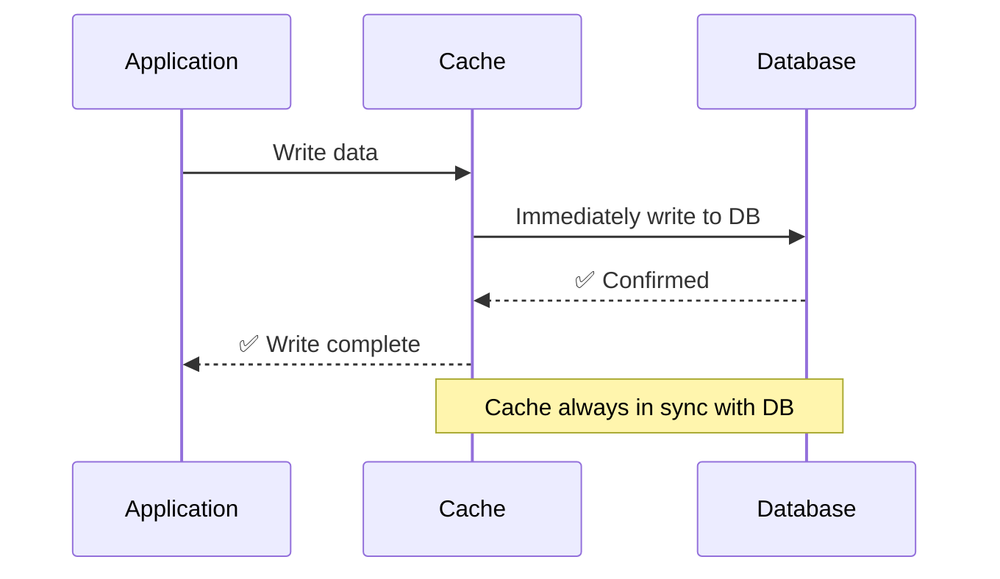
```mermaid
sequenceDiagram
    participant App as Application
    participant Cache as Cache
    participant DB as Database

    App->>Cache: Write data
    Cache->>DB: Immediately write to DB
    DB-->>Cache: ✅ Confirmed
    Cache-->>App: ✅ Write complete
    Note over Cache,DB: Cache always in sync with DB
```

| ✅ Use When | ❌ Avoid When |
|---|---|
| Data must always be fresh | Write-heavy systems — slows writes |
| Read performance is critical | Cache fills with cold data that's never read |

---

### 2.4 Write-Behind (Write-Back)

> Write to cache first → flush to DB asynchronously. Fastest writes.

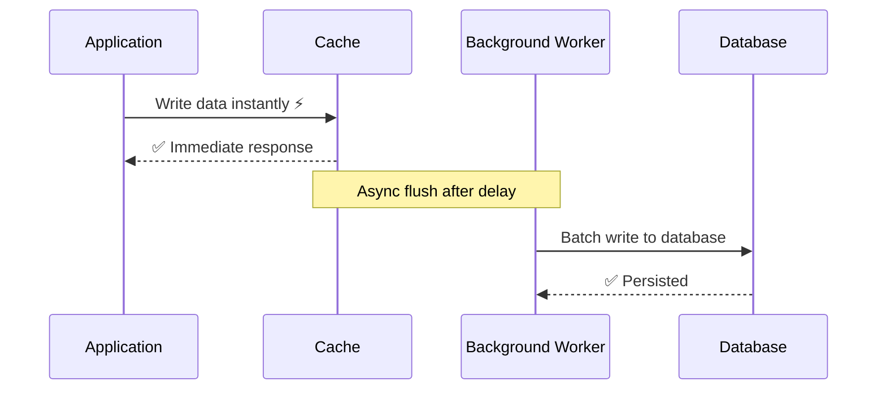
```mermaid
sequenceDiagram
    participant App as Application
    participant Cache as Cache
    participant Worker as Background Worker
    participant DB as Database

    App->>Cache: Write data instantly ⚡
    Cache-->>App: ✅ Immediate response
    Note over Cache,Worker: Async flush after delay
    Worker->>DB: Batch write to database
    DB-->>Worker: ✅ Persisted
```

| ✅ Use When | ❌ Avoid When |
|---|---|
| Write speed is top priority | Data consistency is critical |
| High write throughput needed | Cache crashes before flush = data loss ❌ |

---

### 2.5 Read-Through

> Cache is the primary data source. App always talks to cache — cache fetches from DB on miss.

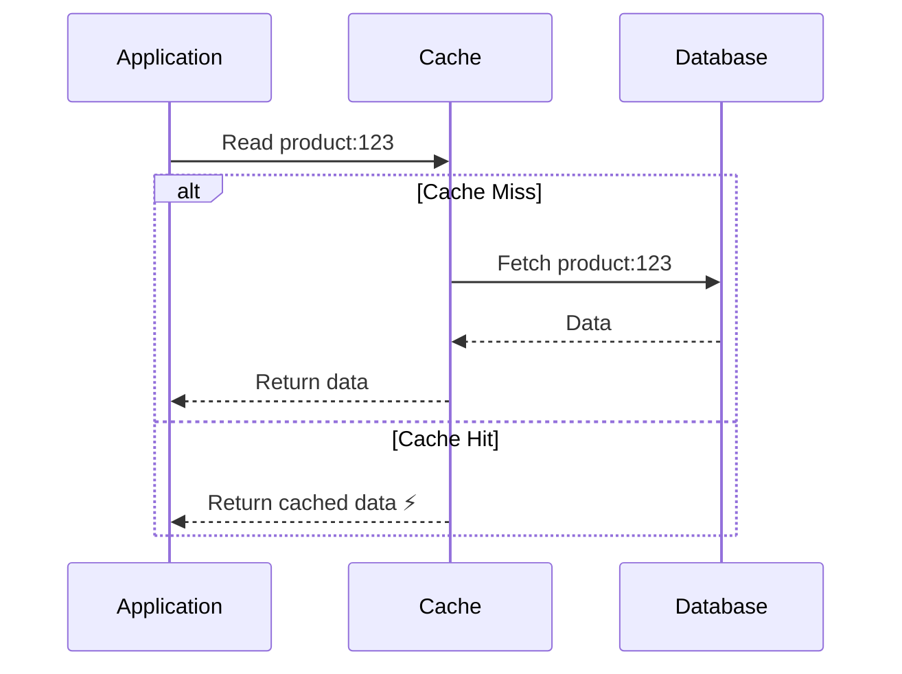
```mermaid
sequenceDiagram
    participant App as Application
    participant Cache as Cache
    participant DB as Database

    App->>Cache: Read product:123
    alt Cache Miss
        Cache->>DB: Fetch product:123
        DB-->>Cache: Data
        Cache-->>App: Return data
    else Cache Hit
        Cache-->>App: Return cached data ⚡
    end
```

---

### 2.6 Strategy Comparison

| Strategy | Read Speed | Write Speed | Consistency | Complexity |
|---|---|---|---|---|
| Cache-Aside | ⚡ Fast (after warm-up) | 🐢 Normal | ⚠️ Eventual | Low |
| Write-Through | ⚡ Fast | 🐢 Slow | ✅ Strong | Medium |
| Write-Behind | ⚡ Fast | ⚡ Fast | ❌ Risk of loss | High |
| Read-Through | ⚡ Fast | 🐢 Normal | ⚠️ Eventual | Medium |

---

### 2.7 Measuring Cache Effectiveness

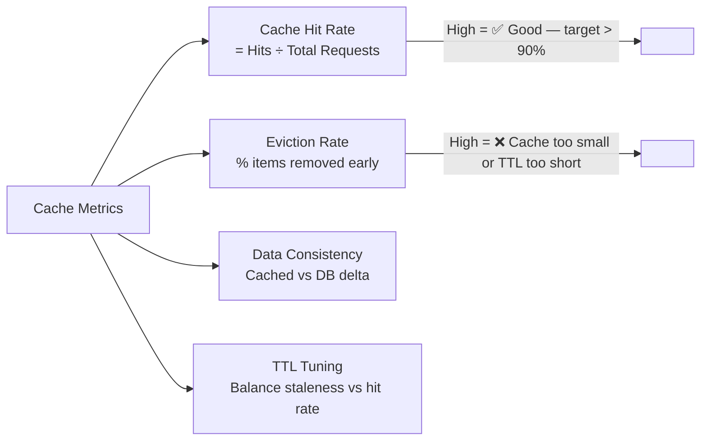
```mermaid
graph LR
    M[Cache Metrics] --> HR["Cache Hit Rate\n= Hits ÷ Total Requests"]
    M --> ER[Eviction Rate\n% items removed early]
    M --> DC[Data Consistency\nCached vs DB delta]
    M --> TTL[TTL Tuning\nBalance staleness vs hit rate]

    HR --> |"High = ✅ Good — target > 90%"| HRR[ ]
    ER --> |"High = ❌ Cache too small or TTL too short"| ERR[ ]
```

> 💡 **Real-life examples:**
> - **E-commerce:** Cache product info in-memory, use distributed cache for multi-region, browser cache for static assets
> - **Banking app:** Cache account balance in-memory, distributed cache across app servers, localStorage for user preferences

---

## 3. Idempotency in API Design

> **Core Idea:** Sending the same request multiple times produces the **same result** as sending it once.

### 3.1 The Problem Without Idempotency

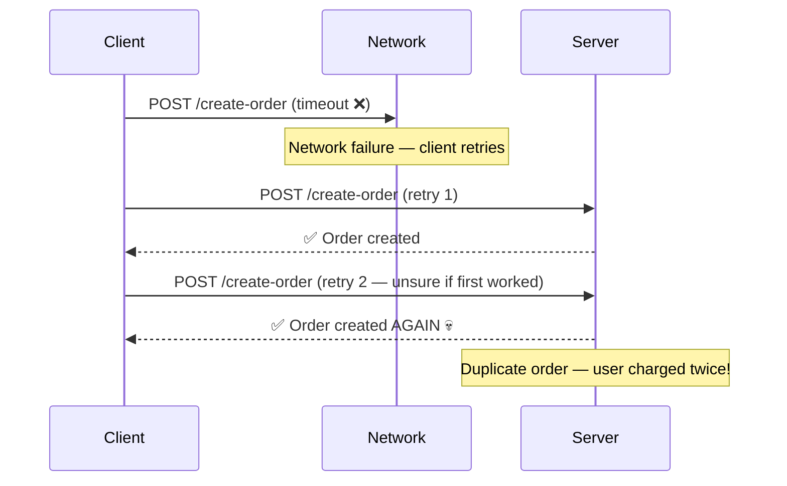
```mermaid
sequenceDiagram
    participant C as Client
    participant N as Network
    participant S as Server

    C->>N: POST /create-order (timeout ❌)
    Note over N: Network failure — client retries
    C->>S: POST /create-order (retry 1)
    S-->>C: ✅ Order created
    C->>S: POST /create-order (retry 2 — unsure if first worked)
    S-->>C: ✅ Order created AGAIN 💀
    Note over S: Duplicate order — user charged twice!
```

---

### 3.2 The Solution — Idempotency Keys

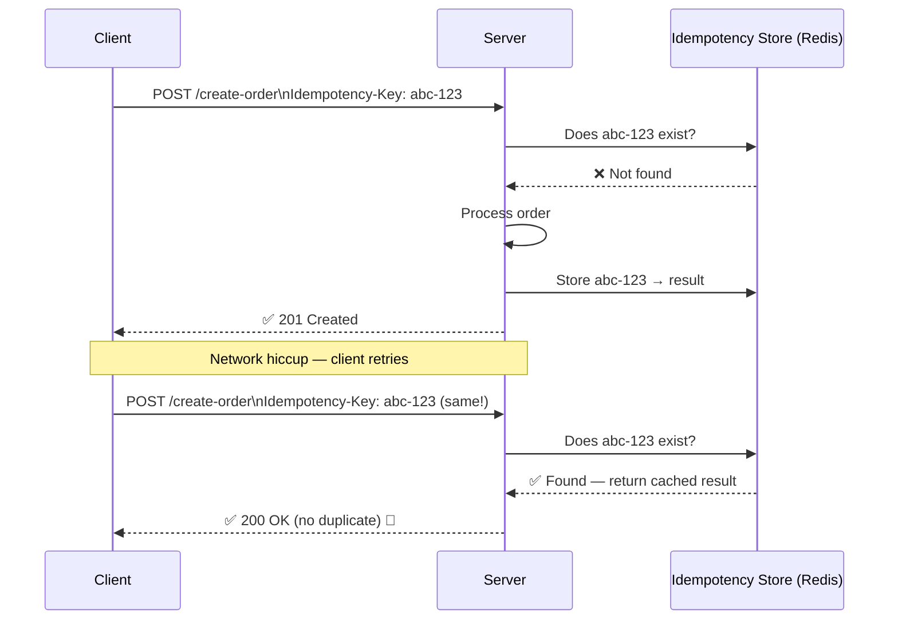
```mermaid
sequenceDiagram
    participant C as Client
    participant S as Server
    participant KV as Idempotency Store (Redis)

    C->>S: POST /create-order\nIdempotency-Key: abc-123
    S->>KV: Does abc-123 exist?
    KV-->>S: ❌ Not found
    S->>S: Process order
    S->>KV: Store abc-123 → result
    S-->>C: ✅ 201 Created

    Note over C,S: Network hiccup — client retries

    C->>S: POST /create-order\nIdempotency-Key: abc-123 (same!)
    S->>KV: Does abc-123 exist?
    KV-->>S: ✅ Found — return cached result
    S-->>C: ✅ 200 OK (no duplicate) 🎉
```

---

### 3.3 Idempotency Key Lifecycle

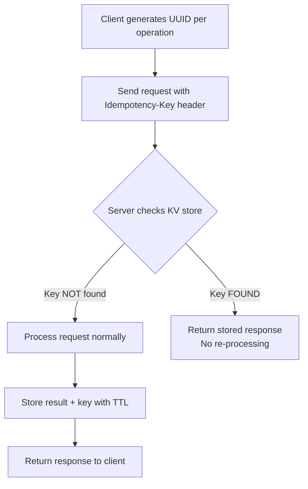
```mermaid
flowchart TD
    A[Client generates UUID per operation] --> B[Send request with Idempotency-Key header]
    B --> C{Server checks KV store}
    C -->|Key NOT found| D[Process request normally]
    C -->|Key FOUND| E[Return stored response\nNo re-processing]
    D --> F[Store result + key with TTL]
    F --> G[Return response to client]
```

---

### 3.4 HTTP Methods & Idempotency

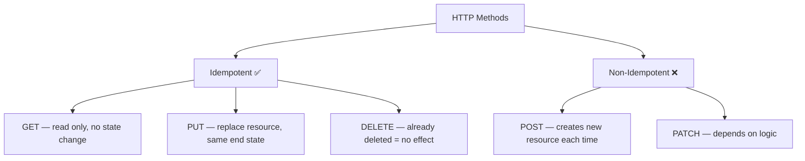
```mermaid
graph TD
    HTTP[HTTP Methods] --> ID[Idempotent ✅]
    HTTP --> NI[Non-Idempotent ❌]

    ID --> GET[GET — read only, no state change]
    ID --> PUT[PUT — replace resource, same end state]
    ID --> DELETE[DELETE — already deleted = no effect]

    NI --> POST[POST — creates new resource each time]
    NI --> PATCH[PATCH — depends on logic]
```

| Method | Idempotent? | Why |
|---|---|---|
| `GET` | ✅ Yes | Only reads, never changes state |
| `PUT` | ✅ Yes | Replaces entire resource — same end state |
| `DELETE` | ✅ Yes | Already deleted = no effect |
| `POST` | ❌ No | Creates new resource on each call |
| `PATCH` | ⚠️ Depends | `increment by 1` is NOT idempotent |

---

### 3.5 Common Use Cases

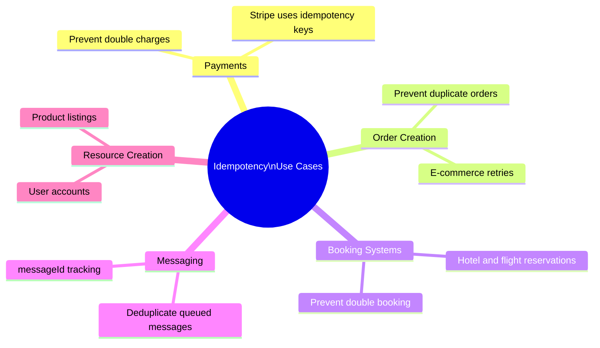
```mermaid
mindmap
  root((Idempotency\nUse Cases))
    Payments
      Prevent double charges
      Stripe uses idempotency keys
    Order Creation
      Prevent duplicate orders
      E-commerce retries
    Booking Systems
      Hotel and flight reservations
      Prevent double booking
    Messaging
      Deduplicate queued messages
      messageId tracking
    Resource Creation
      User accounts
      Product listings
```

---

### 3.6 Implementation — Backend (Node.js)

```js
app.post("/api/products", (req, res) => {
    const { name, description, price } = req.body;
    const idempotencyKey = req.headers["idempotency-key"];

    if (!idempotencyKey)
        return res.status(400).json({ error: "Idempotency-Key header is required" });

    // Return stored result if key already processed
    if (idempotencyKeys[idempotencyKey])
        return res.status(200).json(idempotencyKeys[idempotencyKey]);

    const productId = `product-${Date.now()}`;
    const newProduct = { id: productId, name, description, price };
    products[productId] = newProduct;

    // Store result against the key
    idempotencyKeys[idempotencyKey] = newProduct;
    res.status(201).json(newProduct);
});
```

### 3.7 Implementation — Frontend (React.js)

```js
const handleSubmit = async (e) => {
    e.preventDefault();
    const idempotencyKey = uuidv4(); // new UUID per intended operation
    const res = await axios.post(
        "http://localhost:5000/api/products",
        { name: productName, description, price },
        { headers: { "Idempotency-Key": idempotencyKey } }
    );
    setResponse(res.data);
};
```

> 💡 **Key Rule:** Generate a **new** UUID for each new intended operation. **Reuse the same key** when retrying a failed one.

---

## 4. Database Hotspot & Salting

> **Core Problem:** Hash-based sharding always routes the same key to the same partition.  
> Celebrities cause **hotspots** — one node melts while others sit idle.

### 4.1 The Celebrity Hotspot Problem

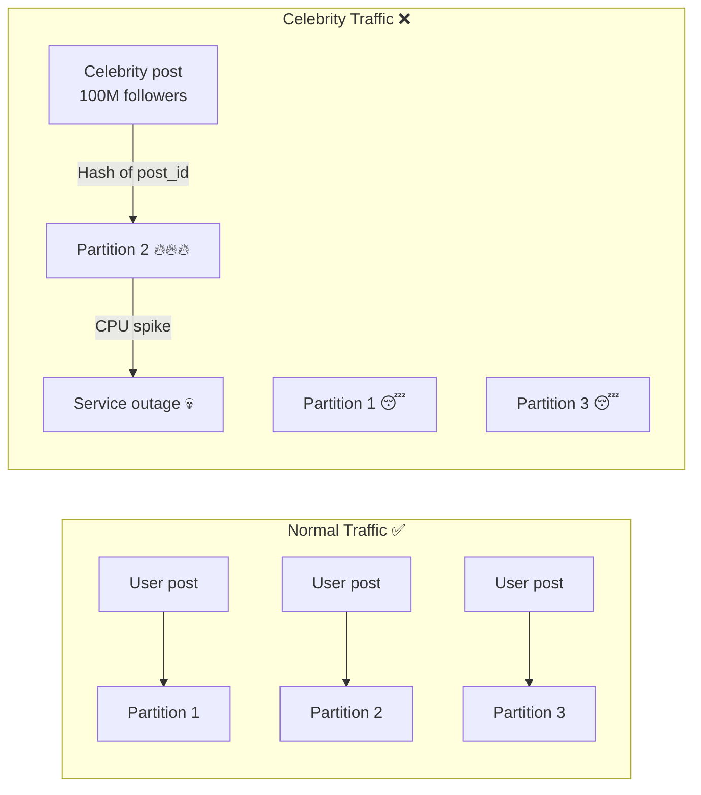
```mermaid
graph LR
    subgraph "Normal Traffic ✅"
        U1[User post] --> P1[Partition 1]
        U2[User post] --> P2[Partition 2]
        U3[User post] --> P3[Partition 3]
    end

    subgraph "Celebrity Traffic ❌"
        C["Celebrity post\n100M followers"] -->|Hash of post_id| HOT[Partition 2 🔥🔥🔥]
        HOT -->|CPU spike| CRASH[Service outage 💀]
        P1_idle[Partition 1 😴]
        P3_idle[Partition 3 😴]
    end
```

> You can have 1,000 nodes — but if all 100,000 writes/sec hit `post_999`, only 1 node is working.

---

### 4.2 The Solution — Key Salting

> Append a random or deterministic suffix to the hot key to spread it across N partitions.

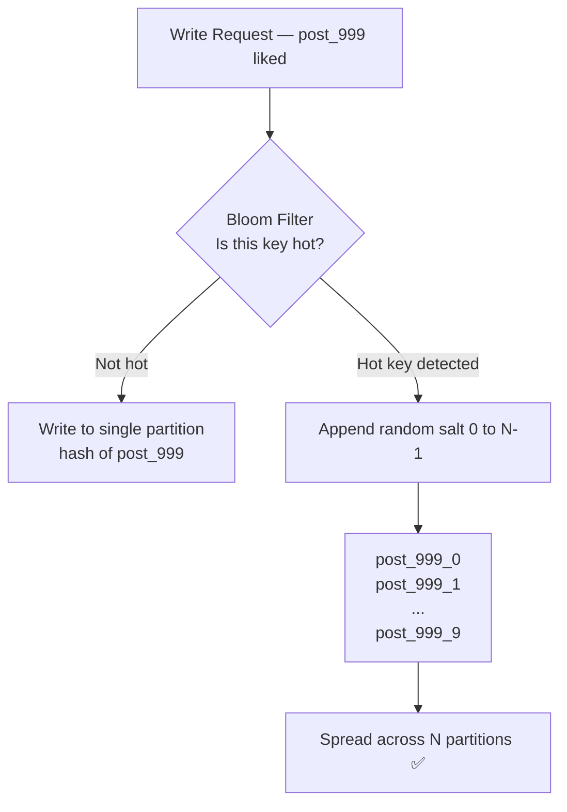
```mermaid
flowchart TD
    W[Write Request — post_999 liked] --> BF{Bloom Filter\nIs this key hot?}
    BF -->|Not hot| NORMAL[Write to single partition\nhash of post_999]
    BF -->|Hot key detected| SALT[Append random salt 0 to N-1]
    SALT --> KEYS["post_999_0\npost_999_1\n...\npost_999_9"]
    KEYS --> SPREAD[Spread across N partitions ✅]
```

---

### 4.3 Write Path vs Read Path

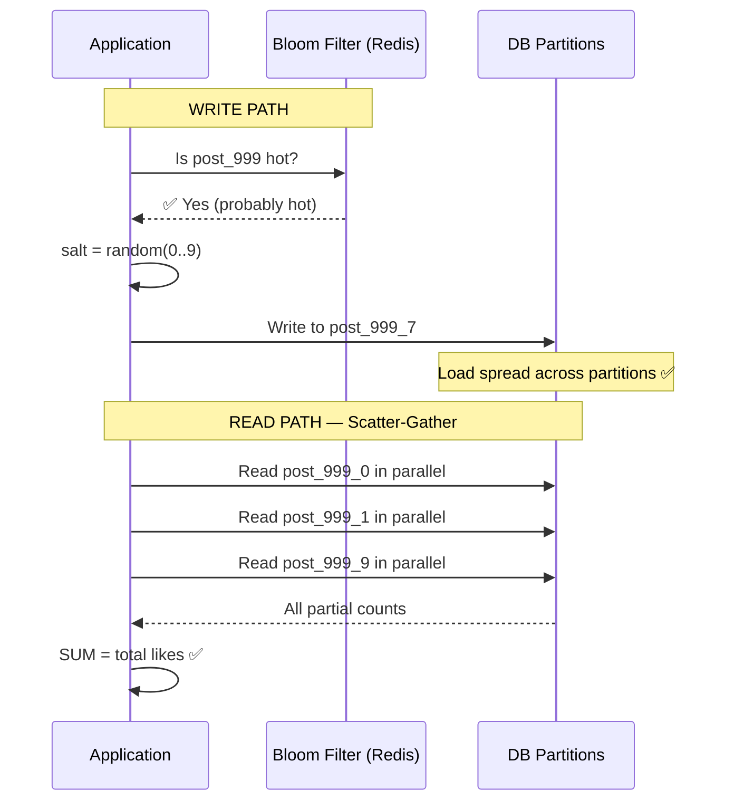
```mermaid
sequenceDiagram
    participant App as Application
    participant BF as Bloom Filter (Redis)
    participant DB as DB Partitions

    Note over App,BF: WRITE PATH
    App->>BF: Is post_999 hot?
    BF-->>App: ✅ Yes (probably hot)
    App->>App: salt = random(0..9)
    App->>DB: Write to post_999_7
    Note over DB: Load spread across partitions ✅

    Note over App,DB: READ PATH — Scatter-Gather
    App->>DB: Read post_999_0 in parallel
    App->>DB: Read post_999_1 in parallel
    App->>DB: Read post_999_9 in parallel
    DB-->>App: All partial counts
    App->>App: SUM = total likes ✅
```

---

### 4.4 Bloom Filter — Smart Hot Key Detection

```mermaid
graph LR
    R[Request arrives] --> BF[Bloom Filter\nin memory / Redis]
    BF -->|Negative — definitely NOT hot| FAST[Standard single write ⚡]
    BF -->|Positive — possibly hot| SALT[Apply salting logic\nSplit across N partitions]
    SALT --> SCATTER[Scatter-gather on read]
```

| Property | Bloom Filter |
|---|---|
| False Positives | Possible — may salt unnecessarily (acceptable) |
| False Negatives | **Never** — won't miss a real hotspot |
| Speed | Near-zero latency ⚡ |
| Memory | Tiny — bits, not bytes |

---

### 4.5 Salting Code

```python
if bloom_filter.contains(post_id):
    salt = random.randint(0, 9)
    salted_key = f"{post_id}_{salt}"
else:
    salted_key = post_id

db.increment(salted_key)
```

---

### 4.6 Migration — What About Old Data?

```mermaid
flowchart TD
    Q{Hotspot from\nnew activity?} -->|Yes| LIVE[Start salting immediately\nCode reads old + new salted keys]
    Q -->|No - existing dataset| MIGRATE[Full redistribution required]
    MIGRATE --> BG[Background migration script]
    BG --> LOW[Run during low-traffic window]
    BG --> RE[Re-write records to salted partitions]
```

---

### 4.7 Key Takeaways

| Practice | Action |
|---|---|
| 🔍 Monitor for skew | Alert when one partition has 3x the CPU of peers |
| 🌸 Use Bloom Filters | Keep salting lazy — only trigger on actual hotspots |
| ⏰ Automate lifecycle | Aggregate salted keys back once key cools down |
| 📊 Choose N wisely | Balance write spread vs read scatter-gather cost |
| 🔀 Deterministic salt | Use `hash(user_id) % N` for consistent routing |

---

## 5. DynamoDB vs S3 — Where Should Data Live?

> **Core Question:** Both store data — but they solve fundamentally different problems.

### 5.1 The Core Difference

```mermaid
graph TD
    D[Where should this data live?] --> DDB[DynamoDB]
    D --> S3[Amazon S3]

    DDB --> DDB1[Key-Value Database]
    DDB --> DDB2[Single-digit ms latency]
    DDB --> DDB3[Hot request path data]
    DDB --> DDB4[Cost = per read and write]

    S3 --> S31[Object Storage]
    S3 --> S32[Tens to hundreds of ms latency]
    S3 --> S33[Unlimited scale, 11-nines durability]
    S3 --> S34[Cost = per GB stored]
```

---

### 5.2 DynamoDB — Optimized for Access

> Given a partition key → routes directly to the correct partition → consistent ms latency.

```mermaid
sequenceDiagram
    participant App as Application
    participant DDB as DynamoDB

    App->>DDB: GET user:42
    Note over DDB: Route directly to correct partition
    DDB-->>App: ⚡ Response < 10ms
    Note over App,DDB: Same latency regardless of total scale
```

| Characteristic | Detail |
|---|---|
| Access pattern | Key-value by partition key |
| Latency | Single-digit ms |
| Pricing driver | Read/Write Capacity Units |
| Best for | Live app data on hot request path |
| Table classes | Standard (hot) · Standard-IA (infrequent access) |

> ⚠️ **Standard-IA Warning:** Cheaper storage, but higher read cost. If data is so cold you barely access it — it probably shouldn't be in DynamoDB at all.

---

### 5.3 S3 — Optimized for Durable Storage

```mermaid
sequenceDiagram
    participant App as Application
    participant S3 as Amazon S3
    participant CDN as CloudFront CDN

    App->>S3: PUT image.jpg
    S3-->>App: ✅ Stored (11 nines durability)

    Note over S3,CDN: Serve to millions via CDN
    CDN->>S3: Origin fetch on first miss
    S3-->>CDN: File
    CDN-->>App: Fast delivery ⚡
```

| Characteristic | Detail |
|---|---|
| Access pattern | Object key lookup (not query-able) |
| Latency | Tens–hundreds of ms |
| Pricing driver | GB stored + per-request cost |
| Best for | Static assets, archives, data lakes, backups |
| Max object size | 5 TB |

---

### 5.4 Data Lifecycle — The Real Decision Driver

> Data doesn't stay hot forever. The right store depends on **where in the lifecycle it is**.

```mermaid
flowchart LR
    A["🔥 Hot\nActive reads & writes"] -->|Ages out| B["🌡️ Warm\nLess frequent access"]
    B -->|Rarely accessed| C["🧊 Cold\nArchival only"]

    A --> DDB1["DynamoDB Standard\nFast, expensive"]
    B --> DDB2["DynamoDB Standard-IA\nCheaper, still queryable"]
    C --> S3A["S3 Standard / Glacier\nCheapest, durable"]
```

**Real-world example — Messaging System:**

```mermaid
sequenceDiagram
    participant U as User
    participant App as App Server
    participant DDB as DynamoDB
    participant S3 as S3

    U->>App: Open chat
    App->>DDB: Fetch last 30 messages (hot data)
    DDB-->>App: ⚡ Returned in ms

    Note over DDB,S3: Background job runs nightly
    DDB->>S3: Export messages older than 90 days
    S3-->>S3: Stored cheaply 💾

    U->>App: Load history from 2 years ago
    App->>S3: Fetch archived messages
    S3-->>App: 📦 Returned (higher latency is OK)
    App-->>U: Historical view loaded
```

---

### 5.5 Side-by-Side Comparison

| Dimension | DynamoDB | S3 |
|---|---|---|
| **Abstraction** | Table → Items → Attributes | Bucket → Objects |
| **Query capability** | ✅ Rich (GSI, LSI, filters) | ❌ Key lookup only |
| **Latency** | ⚡ Single-digit ms | 🐢 Tens–hundreds of ms |
| **Cost model** | Per read/write unit | Per GB stored |
| **Max item/object size** | 400 KB | 5 TB |
| **CDN integration** | ❌ Not designed for it | ✅ Native with CloudFront |
| **Best on request path** | ✅ Yes | ⚠️ Possible but not ideal |
| **Large files** | ❌ 400KB limit | ✅ Up to 5TB |
| **Durability** | ✅ Multi-AZ replication | ✅ 11 nines |

---

### 5.6 Decision Guide

```mermaid
flowchart TD
    START[Where should this data live?] --> Q1{On the hot\nrequest path?}
    Q1 -->|Yes — needs ms latency| Q2{Structured key-value?}
    Q1 -->|No — batch or archival| Q3{Large blob or file?}

    Q2 -->|Yes| DDB[DynamoDB ✅]
    Q2 -->|Needs SQL joins| RDS[RDS / Aurora]

    Q3 -->|Yes — image, video, doc| S3[S3 ✅]
    Q3 -->|Rarely queried records| Q4{How old is the data?}

    Q4 -->|Under 90 days| DDBIA[DynamoDB Standard-IA]
    Q4 -->|Older — archival| S3G[S3 Glacier]
```

> 💡 **Rule of thumb:**
> - Data your app reads **per user request** → **DynamoDB**
> - Data that just needs to **exist reliably and cheaply** → **S3**
> - Data that **started hot but aged out** → migrate DynamoDB → S3

---

## 6. Quick Revision Cheatsheet

```mermaid
mindmap
  root((HLD Notes))
    Fanout
      Push = pre-compute feeds at write time
      Pull = compute at read time
      Hybrid = real-world winner
      Celebrity = selective fanout
    Caching
      Cache-Aside = lazy app-managed
      Write-Through = always consistent
      Write-Behind = fastest writes
      Read-Through = cache-first
      Measure hit rate and eviction rate
    Idempotency
      Same request = same result always
      UUID key per intended operation
      Reuse key on retry only
      GET PUT DELETE = idempotent
      POST = NOT idempotent
    Hotspot and Salting
      Same key = same partition always
      Celebrity = 100M writes to one node
      Salt = append random suffix
      Bloom Filter = lazy hot key detection
      Scatter-Gather on reads
    DynamoDB vs S3
      DynamoDB = ms latency hot path
      S3 = cheap durable object storage
      Hot to cold = DDB to S3
      S3 plus CDN = internet-scale assets
```

### ⚡ One-Liner Summaries

| Concept | One-Line Summary |
|---|---|
| **Fanout Push** | Pre-compute & push to all followers at write time — fast reads, expensive writes |
| **Fanout Pull** | Compute feed at read time — cheap writes, expensive reads |
| **Hybrid Fanout** | Push for normal users, pull for celebrities — used by Twitter, Instagram |
| **Cache-Aside** | App checks cache, loads from DB on miss, stores result |
| **Write-Through** | Write cache + DB simultaneously — always consistent, slower writes |
| **Write-Behind** | Write cache immediately, flush to DB async — fastest writes, risk of loss |
| **Read-Through** | Cache is the single interface — fetches from DB only on miss |
| **Idempotency Key** | UUID per operation — same request = same result, no duplicates on retry |
| **Key Salting** | Append random suffix to hot key to spread load across N partitions |
| **Bloom Filter** | Probabilistic hot key detector — no false negatives, near-zero latency |
| **DynamoDB** | Key-value DB for ms-latency hot request path data — priced per read/write |
| **S3** | Object store for durable, cheap, scalable storage — priced per GB stored |
| **Data Lifecycle** | Hot → DynamoDB → DynamoDB-IA → S3 → S3 Glacier as data cools down |

---

> 📅 **Sources:** Fanout at Scale (Ahsan Farooq) · Cache Strategies (Moshe Binieli) · Idempotency in API Design (Lelianto Eko Pradana) · Beyond the Sharding Bottleneck (Riya Bagaria) · DynamoDB vs S3 (Aasma Garg)
