# 📚 High Level Design (HLD) — Lecture 1 Notes

---

## Table of Contents
1. [HLD vs LLD](#1-hld-vs-lld)
2. [Application Types](#2-application-types)
3. [Client-Server Model](#3-client-server-model)
4. [Distributed Systems & Scaling](#4-distributed-systems--scaling)
5. [Nodes & Data Integrity](#5-nodes--data-integrity)
6. [Network Communication Protocols](#6-network-communication-protocols)
7. [Application Layer Protocols](#7-application-layer-protocols)
8. [TCP vs UDP](#8-tcp-vs-udp)
9. [DNS — Domain Name System](#9-dns--domain-name-system)
10. [Quick Revision Cheatsheet](#-quick-revision-cheatsheet)

---

## 1. HLD vs LLD

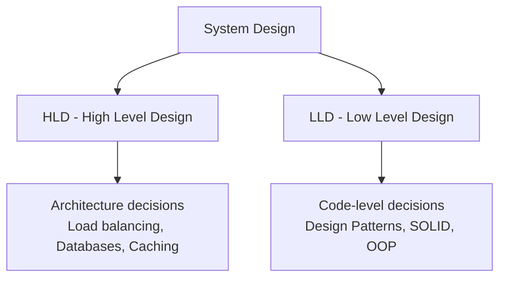

| Feature | HLD (High Level Design) | LLD (Low Level Design) |
|---|---|---|
| Focus | Architecture / Big Picture | Coding patterns & design principles |
| Examples | Load balancing, Databases, Caching | Design patterns (SOLID, OOP) |
| Code | No actual code written | Clean code, loosely coupled modules |
| Scope | Large-scale system decisions | Class / function level decisions |

**HLD covers:**
- System architecture decisions
- Load balancing strategies
- Caching mechanisms
- Message queues
- Internal architecture design

**LLD covers:**
- Object-oriented design (OOP, SOLID principles)
- Design patterns
- Writing clean, maintainable code
- Loosely coupled code structure

---

## 2. Application Types

### Real-World Examples:
- **Applications:** IRCTC, Jio, Spring Boot, Django, etc.
- **Use Cases:**
  - Solutions — DSA tools, ATMs, Dropbox, Canva, Angellist, etc.
  - Databases — SQL, NoSQL, Graph DB, Columnar DB, etc.
  - Transport layer handling millions of users
  - **Back-of-the-envelope estimation** — a critical HLD skill

---

## 3. Client-Server Model

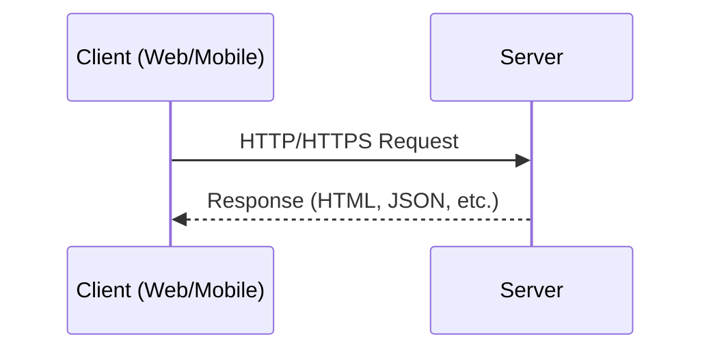

### Request-Response with Distributed System

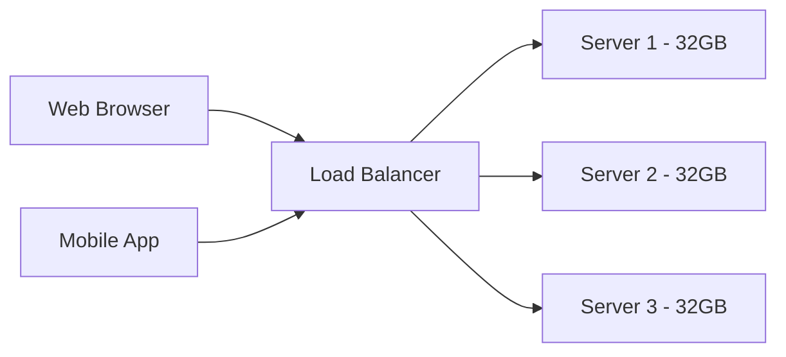

> A single server can only handle a limited number of users. As traffic grows, a **Distributed System** becomes necessary.

---

## 4. Distributed Systems & Scaling

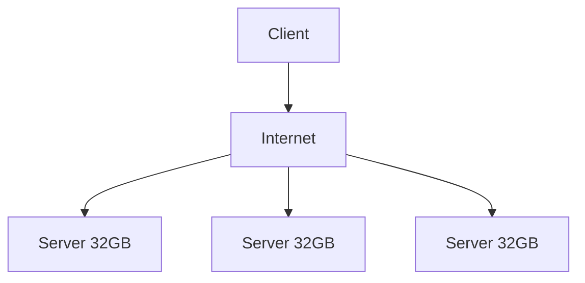

### Two Types of Scaling

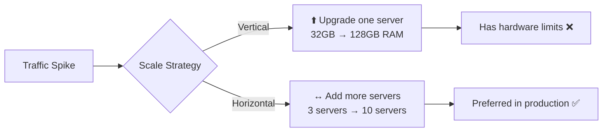

| Type | Meaning | How? |
|---|---|---|
| ⬆️ **Vertical Scaling** | Make one server more powerful | Upgrade RAM/CPU (e.g., 32GB → 128GB) |
| ↔️ **Horizontal Scaling** | Add more servers | Deploy additional machines (preferred ✅) |

> 💡 **Horizontal Scaling is preferred in production** — Vertical scaling hits hardware limits eventually.

---

## 5. Nodes & Data Integrity

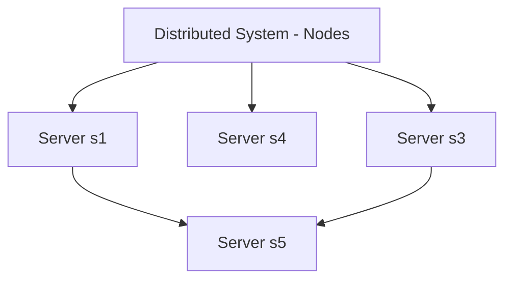

- A **Node** is an individual machine/server in a distributed system.
- Multiple nodes together form a distributed system.
- **Data Integrity** means data must remain consistent and accurate across all nodes.

> ⚠️ **Challenge:** If data is updated on one node, it must eventually be reflected on all other nodes — this is the **consistency problem** in distributed systems.

---

## 6. Network Communication Protocols

### OSI Model — 7 Layer Model

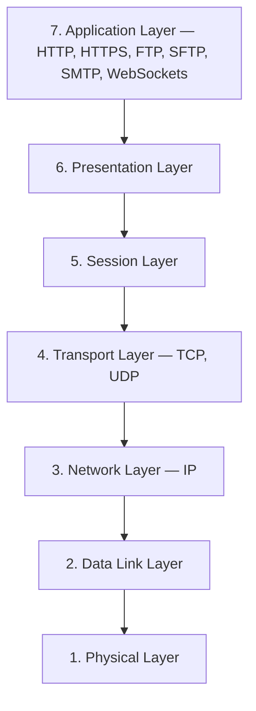

> 🧠 **Mnemonic:** "All People Seem To Need Data Processing"

---

## 7. Application Layer Protocols

### A) FTP / SFTP

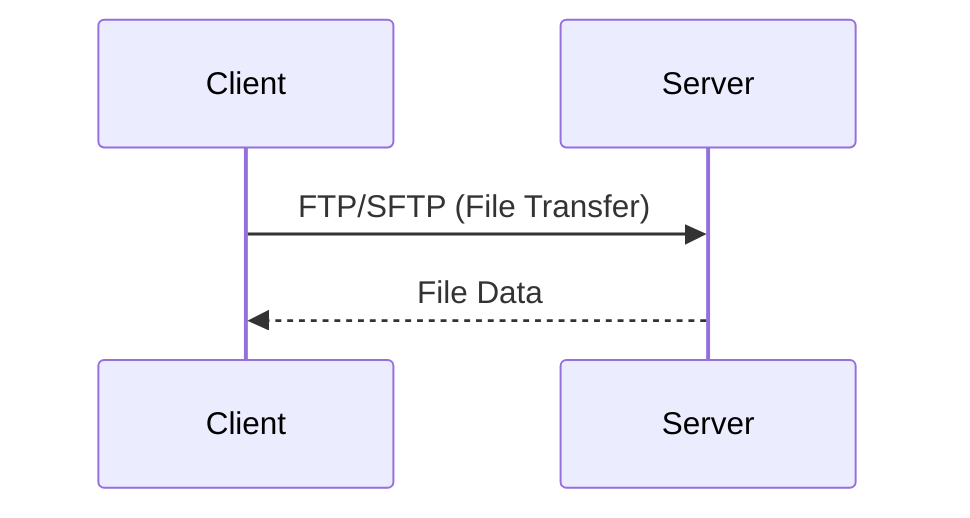

- **FTP** = File Transfer Protocol
- **SFTP** = Secured FTP (encrypted)
- **Use case:** Transferring files between systems

---

### B) SMTP
- **SMTP** = Simple Mail Transfer Protocol
- **Use case:** Sending emails
- Related protocols: **POP3 / IMAP** (for receiving emails)

---

### C) HTTP

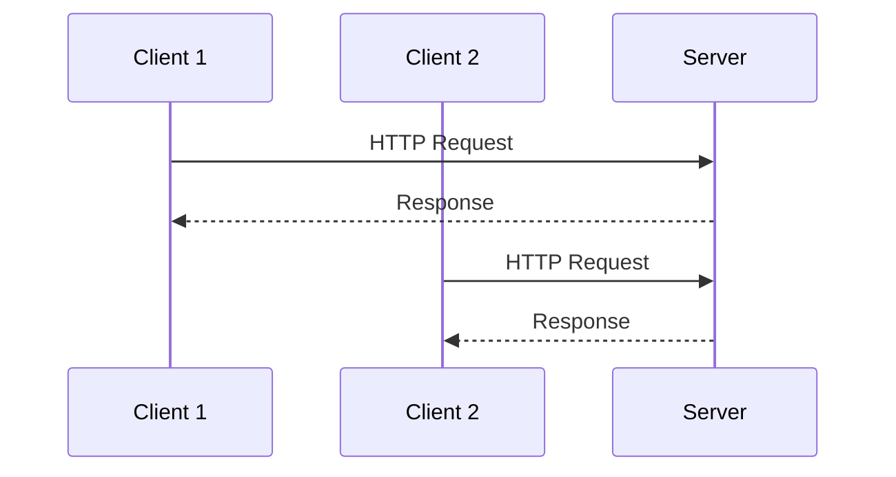

- **HTTP** = HyperText Transfer Protocol
- Works on a **Request → Response** model
- **Unidirectional** — client initiates, server responds

---

### D) WebSockets 🔥

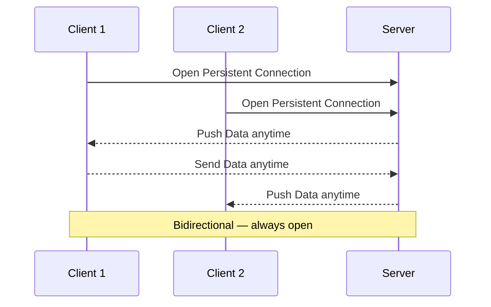

- **Bidirectional** — both client and server can send data at any time
- Connection remains **persistent** (always open)
- **Use cases:** Chat applications, live notifications, real-time dashboards
- **Examples:** WhatsApp Web, stock tickers, online multiplayer games

---

### E) WebRTC (Web Real-Time Communication)

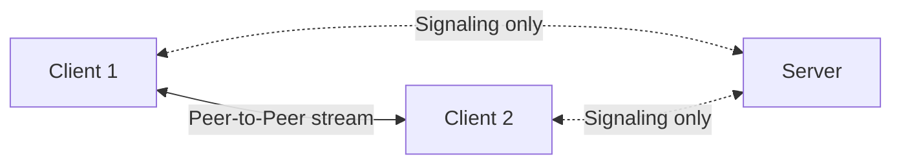

- **Direct peer-to-peer** communication between browsers/clients
- No server required for the data stream (only for initial signaling)
- **Use cases:** Video calls, voice calls, screen sharing
- **Examples:** Google Meet, Zoom, Discord

---

## 8. TCP vs UDP

### TCP — Transmission Control Protocol
> **"Reliable but Slow"**

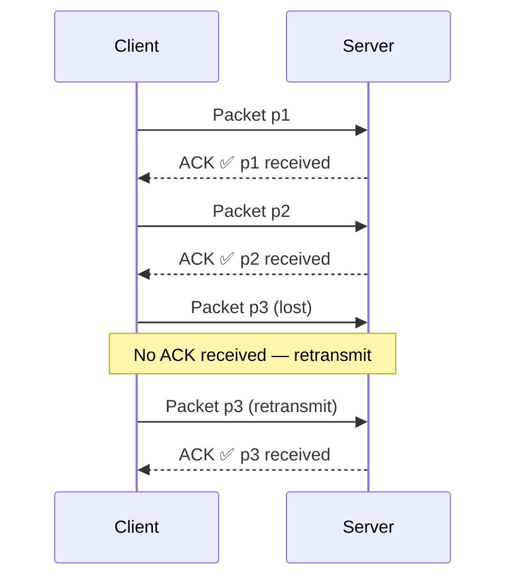

**Use cases:** Banking transactions, email, file transfers, web page loading

---

### UDP — User Datagram Protocol
> **"Fast but Unreliable"**

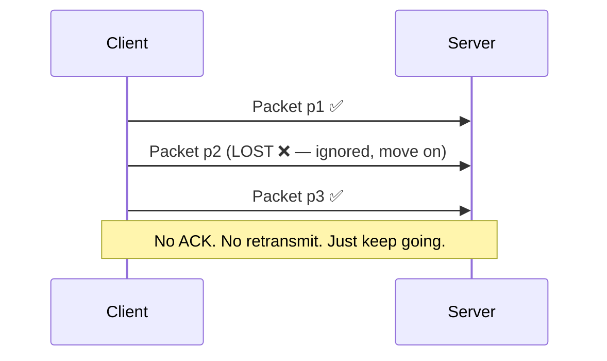

**Use cases:** YouTube/Netflix streaming, online gaming, video calls, live sports broadcasts

---

### TCP vs UDP — Comparison Table

| Feature | TCP | UDP |
|---|---|---|
| Full Name | Transmission Control Protocol | User Datagram Protocol |
| Speed | 🐢 Slow | ⚡ Fast |
| Reliability | ✅ Reliable | ❌ Unreliable |
| Acknowledgement | ✅ Yes (ACK) | ❌ No |
| Connection Type | Connection-oriented | Connectionless |
| Packet Loss | Retransmits | Drops silently |
| Use Case | Banking, Email, File Transfer | Video Streaming, Gaming, Calls |

> 🧠 **Memory Trick:**
> - **TCP = Registered Mail** — confirmed delivery, slower
> - **UDP = Flyer/Pamphlet** — thrown out, no confirmation, fast

---

## 9. DNS — Domain Name System

### The Problem:
- Computers understand only **IP addresses** → e.g., `120.23.23.2`
- Humans remember **domain names** → e.g., `youtube.com`
- **DNS bridges this gap** — it translates names to IP addresses

### DNS = The Internet's Phone Book 📖

| URL | IP Address |
|---|---|
| https://www.youtube.com | 120.23.23.2 |
| https://www.instagram.com | 120.23.24.4 |

### How DNS Works

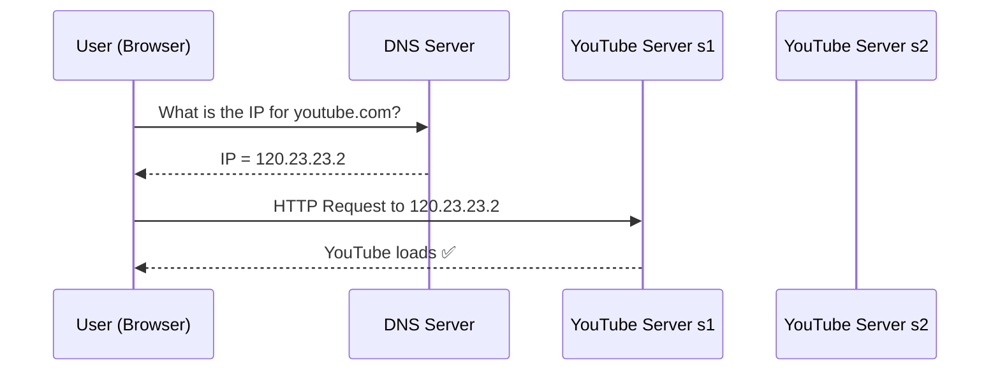

> 💡 **IP = Internet Protocol Address** — Every server on the internet has a unique IP address, just like every house has a unique postal address.

---

## 🔁 Quick Revision Cheatsheet

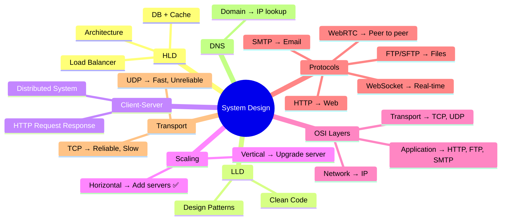

---

> 📅 **Lecture:** HLD — Lecture 1
