# RabbitMQ vs Apache Kafka — Structured Reference

> **Source:** *RabbitMQ vs Apache Kafka: Architectural and Conceptual Differences* — Steffan Kharmaaiarvi (Medium, Jul 2025)

---

## 1. Mental Model (One-liner Analogy)

| System | Analogy |
|--------|---------|
| **RabbitMQ** | A **post office** — routes and delivers messages to the right recipients |
| **Kafka** | A **library / commit log** — consumers come and read at their own pace |

---

## 2. Architecture Overview

### RabbitMQ

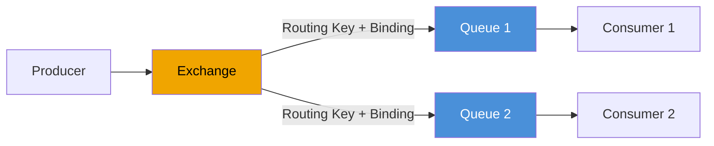

- Core components: **Producer, Exchange, Queue, Binding**
- Exchange **types**: `direct`, `fanout`, `topic`, `headers`
- **Routing key** on the message determines which queue gets it
- **Smart broker, dumb consumer** — broker handles routing, tracking, delivery
- Consumer receives messages **pushed** from the broker
- Message is **deleted after ACK** (no replay by default)

### Apache Kafka

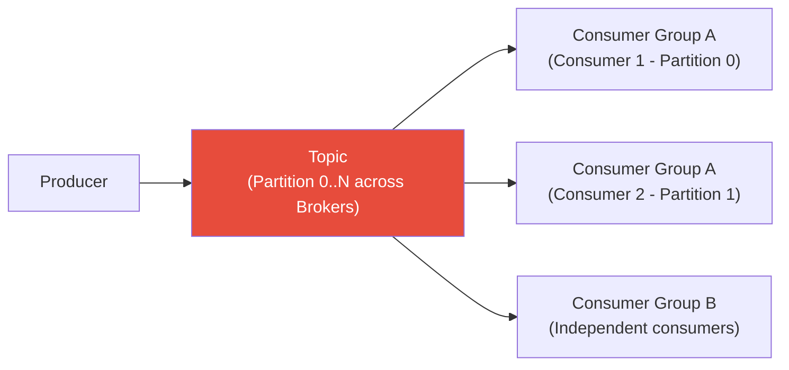

- Core components: **Producer, Topic, Partition, Broker, Consumer Group**
- Each partition = **append-only log** on disk
- **Dumb broker, smart consumer** — consumers track their own **offset**
- Consumers **pull** data at their own pace
- Messages are **retained for a configurable period** (default 7 days) — replay is possible

---

## 3. Push vs Pull Delivery

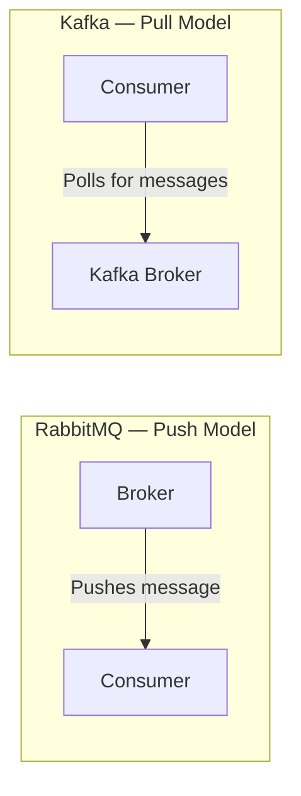

| Aspect | RabbitMQ (Push) | Kafka (Pull) |
|--------|----------------|-------------|
| Who initiates | **Broker** pushes to ready consumers | **Consumer** polls the broker |
| Latency | Lower — immediate delivery | Slightly higher — poll interval + batching |
| Backpressure | `prefetch` / QoS limit prevents overwhelming slow consumers | Consumer controls its own fetch rate |
| Slow consumers | Broker pauses delivery until they catch up | Consumer falls behind in offset; doesn't affect others |
| Best for | Task queues, real-time delivery | Stream pipelines, multi-consumer feeds |

> **Note:** Amazon SQS also uses a **pull** model (long-poll via API).

---

## 4. Message Routing & Patterns

### RabbitMQ — Rich Routing

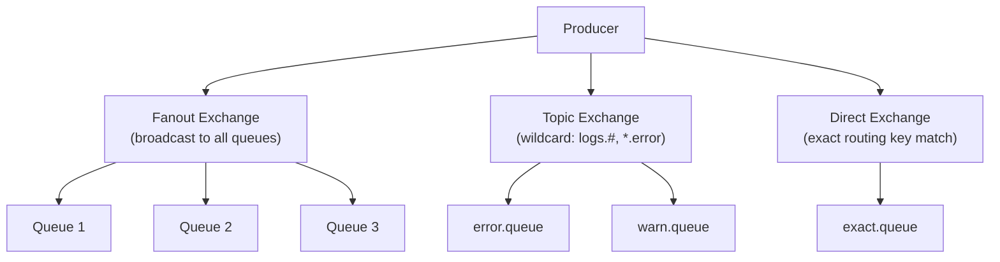

### Kafka — Simple Topic Model

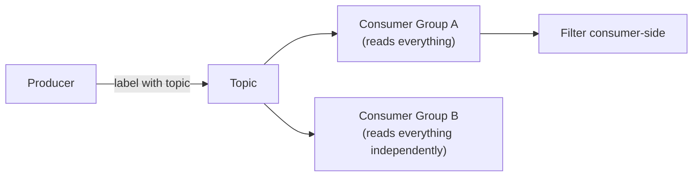

### Key Difference
| Scenario | Winner |
|----------|--------|
| Sophisticated routing / content-based filtering | **RabbitMQ** |
| One stream → many independent downstream consumers | **Kafka** |
| Protocol bridging (MQTT, STOMP, JMS) | **RabbitMQ** |
| High-throughput event fan-out | **Kafka** |

---

## 5. Delivery Guarantees

### Semantics Comparison

| Guarantee | RabbitMQ | Kafka |
|-----------|----------|-------|
| **At-most-once** | Possible (no ack, auto-ack) | Consumer commits offset before processing |
| **At-least-once** | ✅ Default (ACK/NACK + requeue) | ✅ Default (re-read from last committed offset on restart) |
| **Exactly-once** | ❌ No built-in; requires consumer-side de-duplication | ✅ Via idempotent producers + transactional API (Kafka Streams) |

### RabbitMQ Delivery Flow

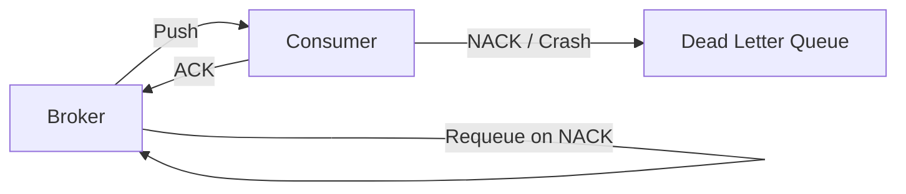

### Kafka Delivery Flow

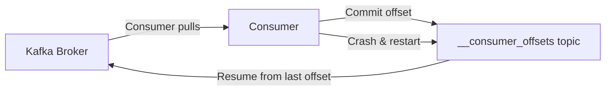

---

## 6. Ordering Guarantees

| System | Ordering Guarantee |
|--------|-------------------|
| **RabbitMQ** | FIFO **per queue**; ordering breaks with multiple consumers on one queue |
| **Kafka** | Strict order **within a partition**; no cross-partition order |

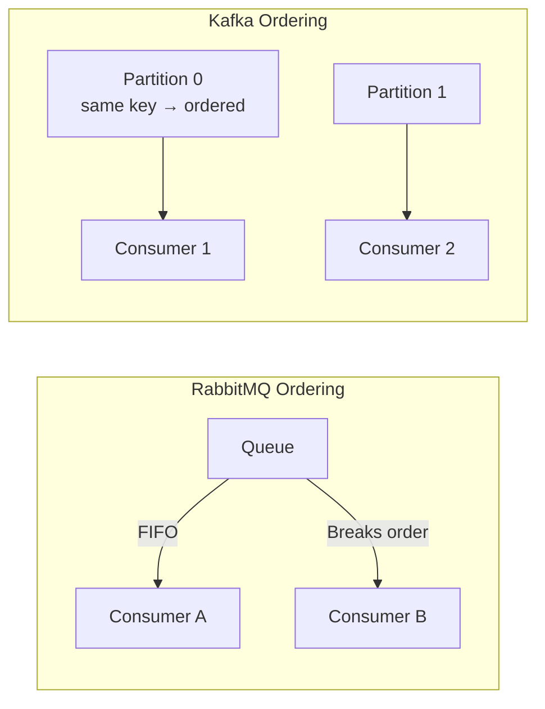

- **RabbitMQ tip:** For strict ordering, use a single consumer per queue.
- **Kafka tip:** Send related messages with the **same key** → same partition → ordered.

---

## 7. Performance: Latency vs Throughput

| Metric | RabbitMQ | Kafka |
|--------|----------|-------|
| **Throughput** | ~4K–10K msg/sec per node | Up to **1M+ msg/sec** on a cluster |
| **Latency** | Sub-millisecond to low-millisecond | Tens of milliseconds (tunable) |
| **Bottleneck** | CPU & memory (routing, ack tracking) | Disk I/O & bandwidth (sequential writes) |
| **Batching** | Per-message dispatch | Batched fetches → optimized for throughput |

> **Rule of thumb:**
> - Use RabbitMQ for **low-latency, task-driven** workloads
> - Use Kafka for **high-throughput, streaming** workloads

---

## 8. Scalability & Fault Tolerance

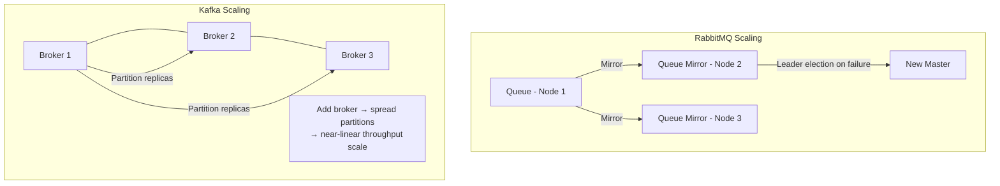

| Aspect | RabbitMQ | Kafka |
|--------|----------|-------|
| Horizontal scale | Manual / plugin-assisted | Native via partitions |
| Single stream scale | Limited (single queue = single node) | Add partitions across brokers |
| HA mechanism | Mirrored queues / quorum queues | Partition replication (RF=3 typical) |
| Leader election | Queue master election | Partition leader (KRaft / ZooKeeper) |

---

## 9. When to Choose What

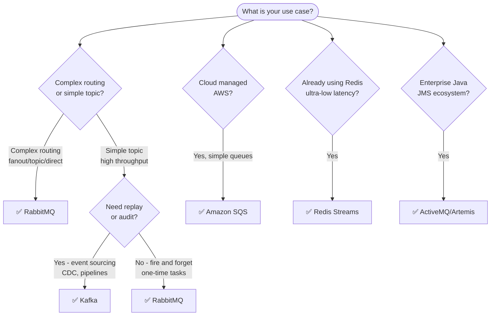

---

## 10. RabbitMQ + Kafka Together (Hybrid Architecture)

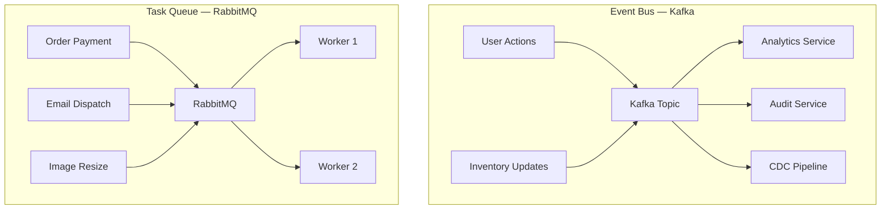

**Pattern:** Use Kafka as the **central event log** for state changes; use RabbitMQ for **command/task dispatch** requiring reliability and routing.

---

## 11. Quick Comparison Table

| Feature | RabbitMQ | Kafka | SQS | Redis Streams | ActiveMQ |
|---------|----------|-------|-----|---------------|----------|
| Model | Push (broker-driven) | Pull (consumer-driven) | Pull | Pull | Push |
| Routing | Rich (exchanges) | Simple (topic) | Minimal | Minimal | JMS-based |
| Throughput | Moderate (K/sec) | Very High (M/sec) | High (managed) | High (in-memory) | Moderate |
| Latency | Sub-ms | Tens of ms | 10–100 ms | Sub-ms | Similar to RabbitMQ |
| Message Replay | ❌ No | ✅ Yes (retention) | ❌ No | ✅ Limited | ❌ No |
| Ordering | Per-queue FIFO | Per-partition | FIFO queues only | Per-stream | Per-queue |
| Exactly-once | ❌ (manual) | ✅ (transactional) | ✅ (FIFO) | ❌ | ✅ (JMS TX) |
| Protocol | AMQP, MQTT, STOMP | Kafka binary | HTTP/AWS SDK | Redis protocol | AMQP, OpenWire, JMS |
| Horizontal scale | Moderate | Excellent | Auto (managed) | Limited | Moderate |
| Best for | Task queues, routing | Event streaming | Simple cloud queues | Low-latency niche | Enterprise Java |

---

## 12. Key Takeaways

1. **RabbitMQ = Smart broker** → handles routing, tracking, immediate delivery → great for **tasks & commands**
2. **Kafka = Durable log** → consumers manage their own position → great for **events & streams**
3. Kafka wins on **throughput and horizontal scale**; RabbitMQ wins on **routing flexibility and low latency**
4. Both default to **at-least-once**; Kafka offers **exactly-once** via transactions; RabbitMQ requires consumer de-duplication
5. Kafka enables **replay**; RabbitMQ messages are **gone after ACK**
6. Ordering: **RabbitMQ = per queue**, **Kafka = per partition**
7. For very large systems, **use both** — Kafka as event bus, RabbitMQ as task dispatcher
