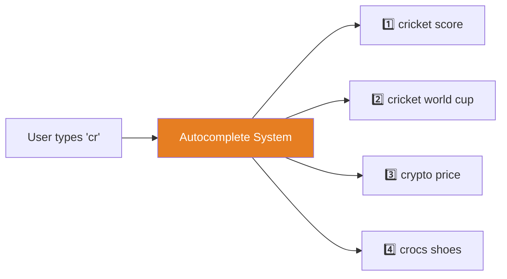
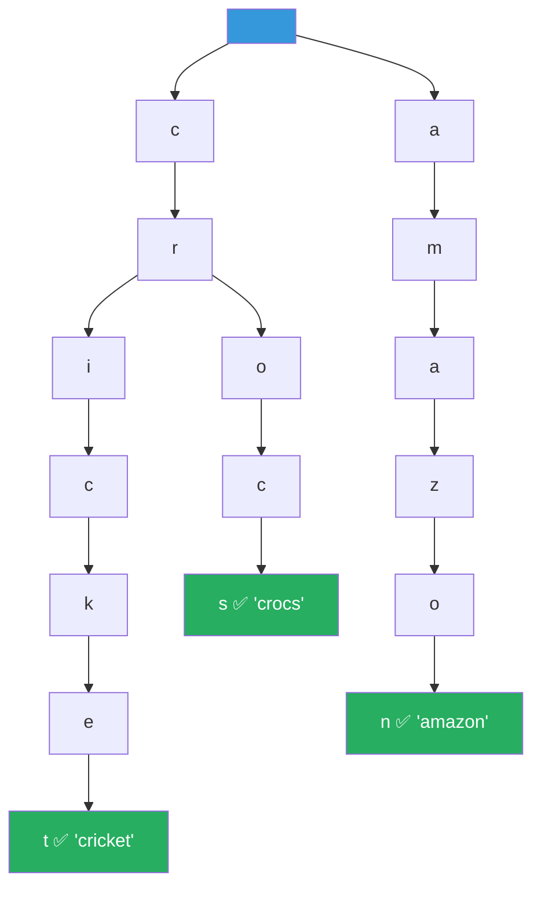
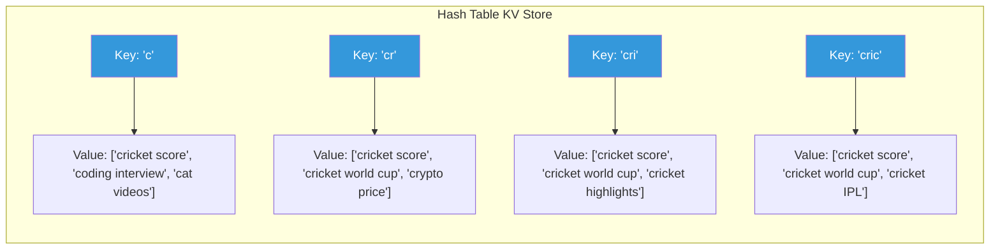
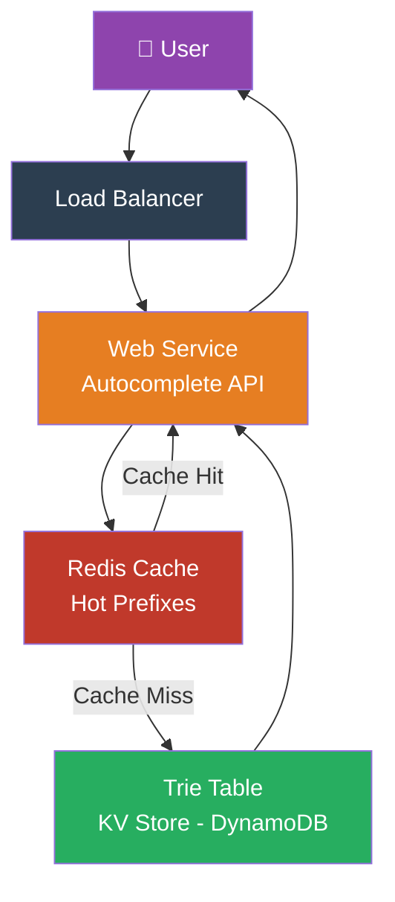
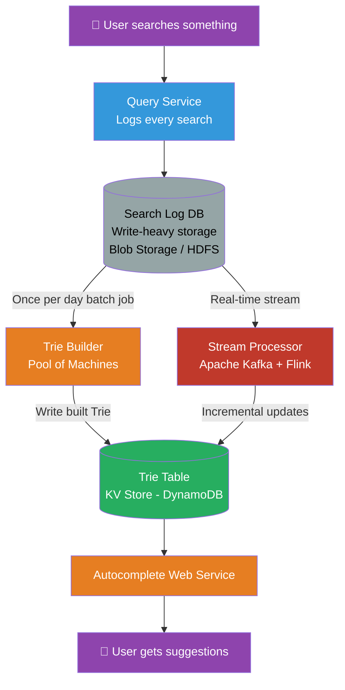
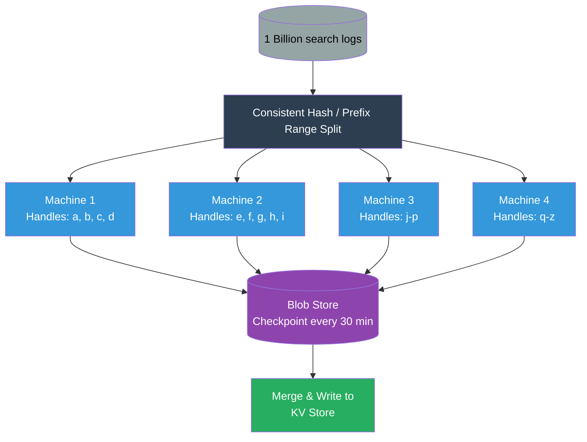
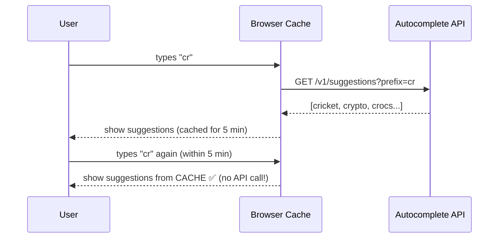
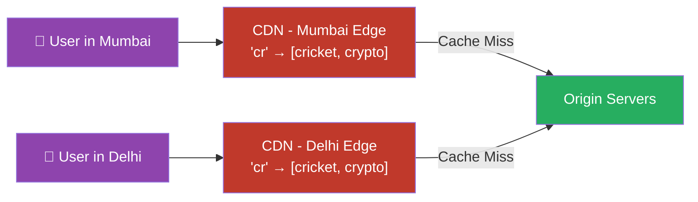

# 🔍 HLD Lecture 11 — Design Search Autocomplete System

A **Search Autocomplete** (also called "typeahead" or "search-as-you-type") is that magical dropdown you see when you start typing on Google, Amazon, YouTube, or Swiggy — it instantly suggests the most popular completions for what you're typing.

> Think of it like a **smart friend who finishes your sentences** — and shows you the most popular ones first.

---

## 📌 Table of Contents

1. [What IS Search Autocomplete?](#1-what-is-search-autocomplete)
2. [Functional Requirements](#2-functional-requirements)
3. [Non-Functional Requirements](#3-non-functional-requirements)
4. [Back-of-the-Envelope Calculations](#4-back-of-the-envelope-calculations)
5. [API Design](#5-api-design)
6. [Core Data Structure — The Trie](#6-core-data-structure--the-trie)
7. [Prefix Hash Table — Scaling the Trie](#7-prefix-hash-table--scaling-the-trie)
8. [High-Level Architecture](#8-high-level-architecture)
9. [Building the Trie — The Data Pipeline](#9-building-the-trie--the-data-pipeline)
10. [Deep Dive — Trie Builder at Scale](#10-deep-dive--trie-builder-at-scale)
11. [Optimizations & Trade-offs](#11-optimizations--trade-offs)
12. [Quick Revision Cheatsheet](#12-quick-revision-cheatsheet)

---

## 1. What IS Search Autocomplete?

When you type **"cr"** on Google, it shows:
- cricket score
- cricket world cup
- crypto price
- crocs shoes

This is **NOT** a coincidence. Behind every suggestion is a massive, pre-computed engine working silently. Let's break it down.

### Real-World Examples
| Platform | Autocomplete Example |
|---|---|
| 🔴 **YouTube** | Type "how to" → shows "how to tie a tie", "how to cook rice" |
| 🛒 **Amazon** | Type "iph" → shows "iphone 15", "iphone case", "iphone charger" |
| 🟢 **Swiggy** | Type "bir" → shows "biryani", "biryani near me" |
| 🔵 **Google** | Type "sys" → shows "system design", "system restore", "system32" |
| 🎵 **Spotify** | Type "ari" → shows "Arijit Singh", "Ariana Grande" |

---

## 2. Functional Requirements

> **"What should this system DO?"**

### ✅ In Scope
1. **Given a prefix, return top N suggestions** (ordered by popularity/usage frequency)
2. Suggestions in **English language**
3. Suggestions ordered by **how often users search for them**

### ❌ Out of Scope
- Personalization (showing results based on YOUR history)
- Regionalization (showing results based on YOUR location)
- Spell correction
- Multi-language support



---

## 3. Non-Functional Requirements

> **"How GOOD should this system be?"**

| Requirement | Value | Why |
|---|---|---|
| ⚡ **Latency** | < 100ms | Autocomplete must feel *instant* — slower and users ignore it |
| 🟢 **Availability** | > 99.99% (4 nines) | Even if no suggestions show, search still works — high availability needed |
| 🔄 **Consistency** | Eventual | Suggestions don't need to be real-time — once/day update is fine |
| 🔁 **Updates** | Once per day | Trending queries update daily (not every second) |

### The Critical Insight 💡
> **"If autocomplete is slow or unavailable, it's an inconvenience — NOT a disaster."**
>
> The core search still works. So we **prioritize Availability over Consistency** (AP system in CAP theorem).

---

## 4. Back-of-the-Envelope Calculations

### Assumptions
- **Daily Active Users (DAU):** 1 Billion (like Google)
- **Searches per user per day:** ~1 query
- **Total daily search queries:** **1 Billion/day**
- **Autocomplete suggestions per search:** ~2 (user types, gets suggestions, might click one)
- **Total autocomplete calls/day:** ~2 Billion

```
QPS (Queries Per Second):
2,000,000,000 / 86,400 seconds ≈ 23,000 QPS → ~20K requests/sec
Peak QPS = 2x average = ~40K requests/sec
```

### Storage Estimate
- If we store **top 1 Billion queries** in our Trie
- Average query size: ~10 KB (including metadata like frequency)
- **Total Trie size ≈ few TBs** → Easily manageable!

| Metric | Value |
|---|---|
| Daily queries | 1 Billion |
| QPS (average) | ~20,000 req/sec |
| Peak QPS | ~40,000 req/sec |
| Trie storage | Few TBs |

---

## 5. API Design

Super simple — just ONE endpoint needed!

```
GET /v1/suggestions?prefix={query}&top={N}
```

### Request
```
GET /v1/suggestions?prefix=cr&top=10
```

### Response
```json
[
  { "suggestion": "cricket score", "frequency": 9800000 },
  { "suggestion": "cricket world cup", "frequency": 8500000 },
  { "suggestion": "crypto price", "frequency": 7200000 },
  { "suggestion": "crocs shoes", "frequency": 3400000 }
]
```

### Why only GET?
- We are **reading** suggestions (not creating/modifying anything)
- GET is **cacheable** — same prefix always gives same top N suggestions
- CDNs and browser caches can store these results!

---

## 6. Core Data Structure — The Trie

> **Trie = Prefix Tree** — the backbone of every search autocomplete engine.

### What is a Trie? (Real-World Analogy)
Imagine a **dictionary arranged as a tree**, where:
- Each **level** represents one character of a word
- Each **path from root to leaf** forms a complete word
- Every **node** knows all the words that start with the characters leading to it



### How Search Autocomplete Uses Trie

When user types `"cr"`:
1. Navigate to node `c`, then node `r`
2. From `cr`, traverse ALL children subtrees
3. Collect all complete words: `cricket`, `crocs`, `crypto`, `crown`...
4. **Sort by frequency** and return Top 10

### The Problem with Naive Trie Traversal
> **PROBLEM:** Traversing ALL children of `"cr"` could take O(n) time where n = number of nodes in subtree = could be millions!

For 20,000 requests/sec, this is **way too slow**. We need O(1) lookup.

---

## 7. Prefix Hash Table — Scaling the Trie

> **The secret sauce 🤫** — Convert the Trie into a Hash Table for O(1) lookups!

### The Modified Trie Node

Instead of just storing the character at each node, we store **the top N suggestions at each node itself**:

```
Node "cr" → stores ["cricket score", "cricket world cup", "crypto price", "crocs shoes", ...]
Node "cri" → stores ["cricket score", "cricket world cup", "cricket highlights", ...]
Node "cro" → stores ["crocs shoes", "crown", "crows", ...]
```

### Prefix Hash Table Mapping



### Real-World Analogy 🏪
Think of it like a **grocery store index**:
- Instead of searching through every aisle for "chips", you have an index at the entrance:
  - `"ch"` → `[chips, chocolate, cheese, chicken]`
  - `"chi"` → `[chips, chicken, chilli, china grass]`
- You **don't walk the whole store** — you just look up the index!

### Why Key-Value (KV) Store?
| Property | Benefit |
|---|---|
| O(1) lookup | Just hash the prefix string → instant results |
| Horizontally scalable | Redis, DynamoDB, Cassandra all support this |
| TTL support | Auto-expire stale suggestions |
| Perfect for this use case | Pure point queries (no JOINs, no range queries) |

**Best DB choice:** **Redis** (in-memory KV store) or **DynamoDB** (managed KV) for the Trie Table

---

## 8. High-Level Architecture

### Simple Version (Starting Point)



### What Each Component Does:

| Component | Role | Real-World Equivalent |
|---|---|---|
| **Load Balancer** | Distributes 20K req/sec across servers | Traffic cop at a busy junction |
| **Web Service** | Handles the API call, returns suggestions | The waiter at a restaurant |
| **Redis Cache** | Stores hot/popular prefixes in memory | The "Top 10" list on a whiteboard |
| **Trie Table (KV Store)** | Stores ALL prefix→suggestions mappings | The main dictionary/index |

---

## 9. Building the Trie — The Data Pipeline

> **The most important part of the whole system!**

How does the Trie know that "cricket score" is more popular than "crocs shoes"? 
Because we **build it from real search data** every day!

### End-to-End Architecture



### Step-by-Step Data Flow

**Step 1 — Log every search:**
```
User searches "cricket score" at 10:01 AM
→ Query Service logs: {query: "cricket score", timestamp: "2025-05-26T10:01:00", userId: "usr_123"}
→ Stored in Log DB (HDFS/S3/BigQuery)
```

**Step 2 — Batch Trie Builder (runs once per day at 2 AM):**
```
1. Read all 1 Billion searches from yesterday's log
2. Count frequency: "cricket score" → 9.8M times, "crocs" → 3.4M times
3. Build Prefix Hash Table:
   "cr" → [cricket score(9.8M), cricket world cup(8.5M), crypto(7.2M), crocs(3.4M)]
4. Write to KV Store (DynamoDB / Redis)
```

**Step 3 — Real-time Stream (Optional, for trending queries):**
```
If "India won World Cup" suddenly trends at 6 PM
→ Kafka captures the spike
→ Flink stream processor updates the KV Store immediately
→ "india won" shows up in autocomplete within minutes
```

### Real-World Analogy 🗞️
Think of it like a **newspaper trending section**:
- **Batch Job** = The morning edition (compiled from yesterday's data, thorough and accurate)
- **Stream Processor** = The "Breaking News" ticker (updates throughout the day for hot topics)

---

## 10. Deep Dive — Trie Builder at Scale

### How to Build a Trie from 1 Billion Queries?

One machine cannot handle 1 Billion queries → **Distribute the work!**



### Prefix Range Examples

| Machine | Handles Prefix Range | Example Queries |
|---|---|---|
| Machine 1 | `a` → `c` | amazon, apple, cricket, crocs |
| Machine 2 | `d` → `f` | delhi, flipkart, facebook |
| Machine 3 | `g` → `m` | google, instagram, jio, mango |
| Machine 4 | `n` → `z` | netflix, swiggy, youtube, zomato |

### Fault Tolerance — Checkpoint to Blob Store
```
Every 30 minutes, Machine 1 saves its progress to S3/GCS.
If Machine 1 crashes mid-job:
  → Restart from last checkpoint
  → No need to reprocess all data from scratch
```

---

## 11. Optimizations & Trade-offs

### Optimization 1 — Client-Side Caching

> **"Don't call the server if you already have the answer!"**



**Benefit:** Reduces server load drastically. If 80% of queries are for popular prefixes → 80% served from client cache!

---

### Optimization 2 — Throttle API Calls (Debouncing)

> **"Don't fire an API call on every single keystroke!"**

```
User types: "c" → "cr" → "cri" → "cric" → "cricke" → "cricket"
Without debounce: 6 API calls made
With debounce (300ms delay): only 1 API call made (when user stops typing)
```

Real-World: **Google search** waits ~300ms after your last keystroke before fetching suggestions.

---

### Optimization 3 — Limit Query Length

> **"Build trees only for reasonable query lengths"**

```
Max supported autocomplete prefix length: 30 characters
Why? Searches longer than 30 chars are almost certainly copy-pasted, 
not natural typing → no benefit to suggesting completions
```

**Benefit:** Saves massive storage — you don't need to pre-compute entries for 100-character prefixes.

---

### Optimization 4 — Content Filtering

> **"Don't suggest harmful or problematic queries"**

When building the Trie, run a **blocklist filter**:
```
If query contains hate speech, illegal content, personal data → SKIP it
```

**Real-World:** Google, YouTube all filter out harmful autocomplete suggestions.

---

### Optimization 5 — CDN for Cached Suggestions



Popular prefixes like `"a"`, `"in"`, `"the"` are served millions of times/day → **Cache at CDN level** → Origin servers only handle the long-tail rare prefixes.

---

### Key Trade-offs Summary

| Trade-off | Choice Made | Reason |
|---|---|---|
| Consistency vs Availability | **Availability** ✅ | Stale suggestions are fine, missing suggestions is not |
| Real-time vs Batch updates | **Batch (+ optional stream)** ✅ | Once/day is enough; real-time is expensive |
| Accuracy vs Speed | **Approximate accuracy** ✅ | Top 5 vs Top 6 doesn't matter; < 100ms does |
| Full Trie vs Prefix Hash | **Prefix Hash Table** ✅ | O(1) vs O(depth) lookup — critical at 20K QPS |
| Build from scratch vs Incremental | **Both** ✅ | Batch for correctness + Stream for trending |

---

## 12. Quick Revision Cheatsheet

```
WHAT IT IS:
  Autocomplete     → Suggest top-N completions for a given prefix, ordered by frequency

KEY REQUIREMENTS:
  Latency          → < 100ms (must feel instant)
  Availability     → > 99.99% (4 nines) — prioritize over consistency
  Updates          → Once per day (batch) + optional real-time stream
  Scale            → 1B queries/day → ~20K QPS

CORE DATA STRUCTURE:
  Trie (Prefix Tree)      → Tree where each path = a word, each node = a character
  Prefix Hash Table       → Convert Trie to KV store: prefix → [top N suggestions]
  O(1) lookup             → Key = prefix string, Value = pre-computed top N list

STORAGE:
  KV Store                → Redis (hot cache) or DynamoDB (persistent Trie Table)
  Trie size               → Few TBs (1B queries × ~10KB each, after deduplication)

DATA PIPELINE:
  Query Service           → Logs every search to Log DB (HDFS/S3)
  Batch Trie Builder      → Runs daily, distributes work by prefix range
  Stream Processor        → Kafka + Flink for near-real-time trending queries
  Blob Store Checkpoint   → Machines checkpoint every 30 min for fault tolerance

OPTIMIZATIONS:
  Client-side cache       → Browser caches suggestions for 5 min
  Debouncing              → Wait 300ms after last keystroke before API call
  Max prefix length       → Only support prefixes up to N chars (e.g. 30)
  Content filtering       → Blocklist harmful queries during Trie build
  CDN caching             → Popular prefixes cached at edge (near users)

CAP THEOREM:
  AP System               → Available + Partition Tolerant
  Why not CP?             → Stale suggestions OK, but slow/unavailable is not
```

---

*📚 Notes compiled from HLD Lecture 11 — Search Autocomplete System Design*
*📖 References: Alex Xu — System Design Interview Book, Back2BaseCS Medium Article*
*✍️ Written by Saurabh Singh Rajput*
