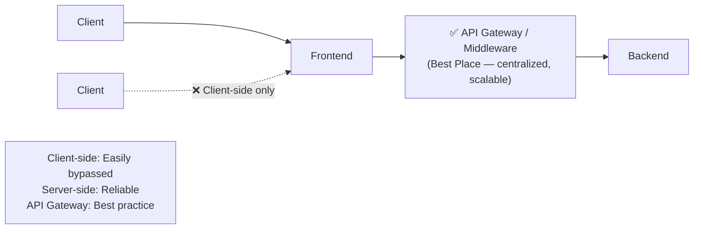
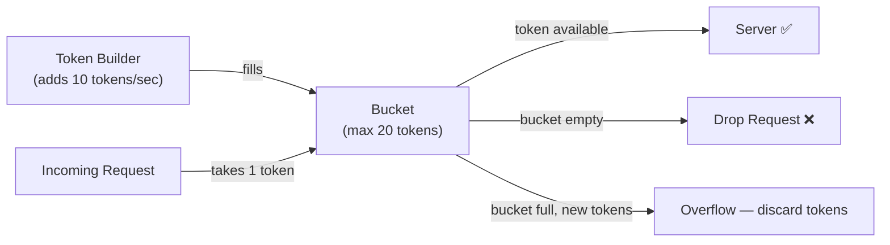
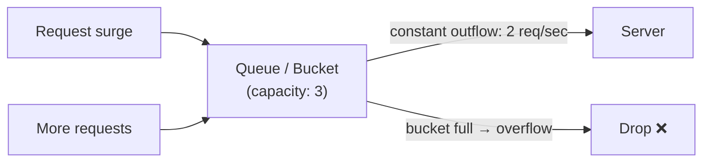
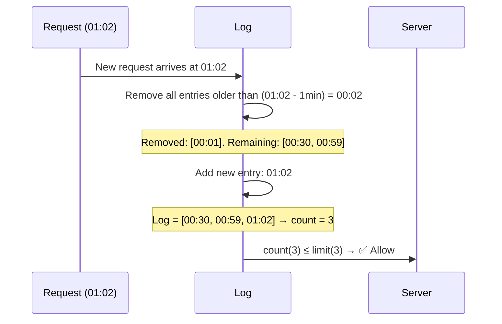
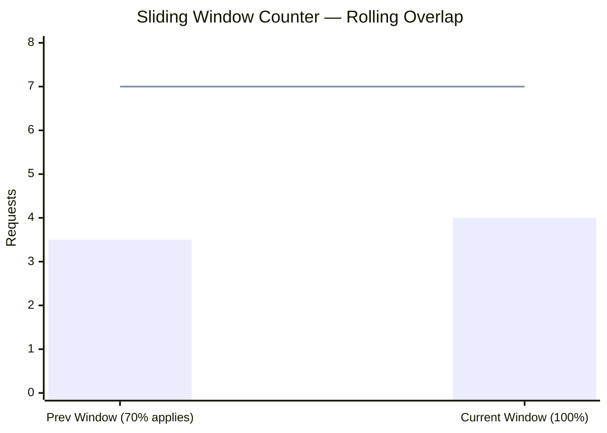
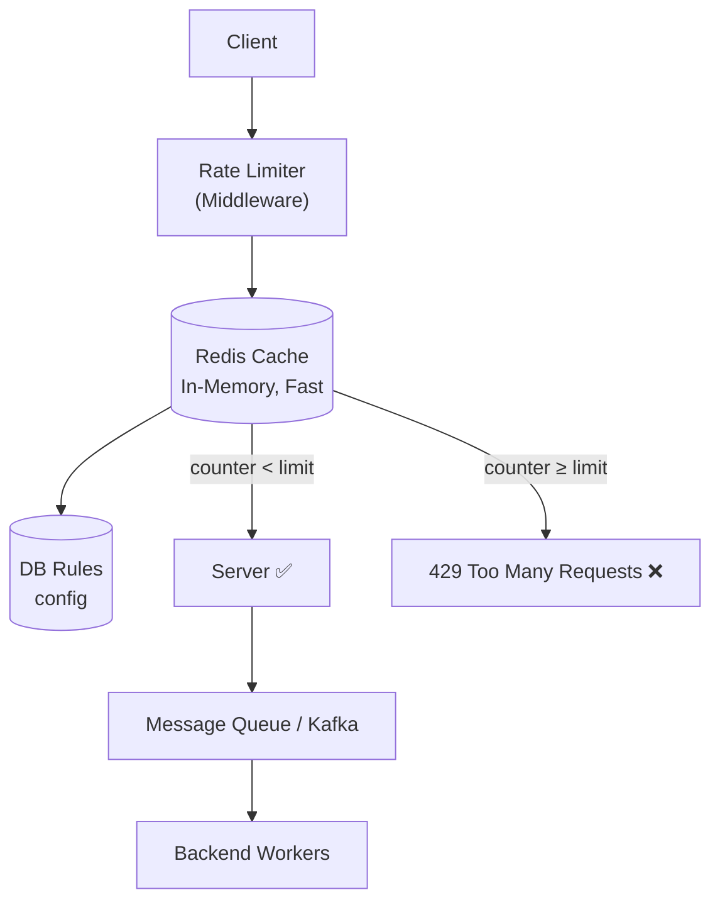

# 🚦 HLD Lecture 5 — Rate Limiting & Caching Strategies

---

## 📌 What is Rate Limiting?

Rate Limiting controls **how many requests a client can send to a server within a given timeframe**.

### Problems Without Rate Limiting:
1. **Client can send too many requests** within a timeframe → leads to **DDoS / DoS attacks**
2. **Server cost becomes expensive** — each request is costly at scale

---

## 🏗️ Where to Apply Rate Limiting?



| Layer | Notes |
|-------|-------|
| **Client Side** | ❌ Worst — can be bypassed easily |
| **Server Side** | ✅ More reliable |
| **Middleware / API Gateway** | ✅ Best practice for large-scale systems |

---

## 🛠️ Application Use Cases

1. **Server-Side Language** (Java, C++, JavaScript, Python) — implement rate limiting logic directly
2. **3rd Party Rate Limiter Providers** — e.g., Amazon AWS API Gateway

---

## 🔑 Rate Limiting — On What Basis?

| Basis | Description |
|-------|-------------|
| **IP Address** | Limit per unique IP |
| **User ID** | Limit per authenticated user |
| **Other Keys** | Primary key, candidate key, API key, etc. |

---

## 📡 HTTP Response Codes for Rate Limiting

| Code | Meaning |
|------|---------|
| `200` | OK |
| `429` | **Too Many Requests** |

### Relevant HTTP Headers:
```
X-api-limit : 2          → max 2 requests allowed
X-duration  : seconds    → per this time window
```

---

## 🧮 Algorithms of Rate Limiting

1. **Token Bucket**
2. **Leaky Bucket**
3. **Fixed Window Counter**
4. **Sliding Window Log**
5. **Sliding Window Counter**

---

### 1️⃣ Token Bucket Algorithm



**Configuration:**
- `Bucket Size` : 20 tokens
- `Inflow Rate` : 10 tokens/sec

**How it works:**
1. Token builder pushes tokens into the bucket at fixed intervals
2. If bucket is **full**, new tokens are **discarded** (overflow)
3. When a request comes → it takes a token from the bucket → goes to server
4. If bucket is **empty** → request is **dropped**

| | |
|-|-|
| **Used by** | Amazon |
| ✅ **Pros** | Simple to implement; can handle **burst traffic** for short durations |
| ❌ **Cons** | Hard to decide optimal bucket capacity and inflow rate |

---

### 2️⃣ Leaky Bucket Algorithm *(Global Rate Limiting)*



**Configuration:**
- `Bucket Capacity` : 3
- `Outflow Rate` : 2 req/sec

**How it works:**
- Requests fill a queue (bucket); they are processed at a **steady outflow rate**
- Excess requests that overflow the bucket are **dropped**

| | |
|-|-|
| **Used by** | Shopify |
| ✅ **Pros** | Simple; protects server even during burst traffic |
| ❌ **Cons** | During DDoS, the queue fills with attack requests → **valid requests starve** |

---

### 3️⃣ Fixed Window Counter

```mermaid
gantt
    title Fixed Window Counter (limit = 3 req/window)
    dateFormat X
    axisFormat s%s

    section Window 1 (00-60s)
    req1 :0, 1
    req2 :20, 21
    req3 :40, 41

    section Window 2 (60-120s)
    req1 :60, 61
    req2 :80, 81
    req3 :100, 101
```



**Fixed Counter = 3**

**⚠️ Edge Case — Burst at Window Boundary:**
```
Limit = 3 req/minute
User sends 3 req at :59 (end of Window 1) ✅ allowed
User sends 3 req at :01 (start of Window 2) ✅ allowed
→ 6 requests in 2 seconds — server takes 2x the load! 💥
```

| | |
|-|-|
| ✅ **Pros** | Simple to implement |
| ❌ **Cons** | **Burst at window edges** — e.g., 3 req at end + 3 req at start = 6 in a short span |

---

### 4️⃣ Sliding Window Log Algorithm

> 🏆 **Best Algorithm for Rate Limiting** — Strict but slow & memory-consuming



> Uses **LINUX EPOCH timestamps** for precision

| | |
|-|-|
| ✅ **Pros** | Most accurate; no edge-case bursts |
| ❌ **Cons** | Slow & memory-intensive (stores every request log) |

---

### 5️⃣ Sliding Window Counter Algorithm *(Hybrid Approach)*

Combines Fixed Window + Sliding Window Log for a **balanced** approach.

**Formula:**
```
Estimated Requests = (Req in current window) + (Req in previous window × overlap%)
```

**Example** (7 req/minute limit, 70% overlap):
```
= 4 (current) + 5 (previous) × 0.7
= 4 + 3.5
= 7.5  →  over limit → drop ❌
```



---

## 🏗️ Building Your Own Rate Limiter

### Architecture



### Why Redis over DB?
| Storage | Speed |
|---------|-------|
| **DB (SQL/NoSQL)** | ❌ Slow for rate limiting |
| **Redis (In-Memory Cache)** | ✅ Fast — ideal for rate limiting |

### Redis Command Used:
```redis
INCR   →  Atomically increment counter in Redis
EXPIRE →  Auto-reset key after window duration
```

### Flow:
1. Request comes in → **Rate Limiter** checks Redis
2. Redis counter < limit → **forward to server**
3. Redis counter ≥ limit → **return `429 Too Many Requests`**
4. Workers and Kafka handle async processing via **Messaging Queue**

---

## 📊 Algorithm Comparison Summary

| Algorithm | Accuracy | Memory | Speed | Burst Handling |
|-----------|----------|--------|-------|----------------|
| Token Bucket | Medium | Low | Fast | ✅ Yes |
| Leaky Bucket | Medium | Low | Fast | ✅ Smoothed |
| Fixed Window | Low | Very Low | Fastest | ❌ Edge bursts |
| Sliding Window Log | **High** | High | Slow | ✅ Yes |
| Sliding Window Counter | High | Medium | Medium | ✅ Yes |

---

*Source: HLD Lecture 5 — Rate Limiting & Caching Strategies*
