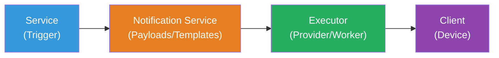
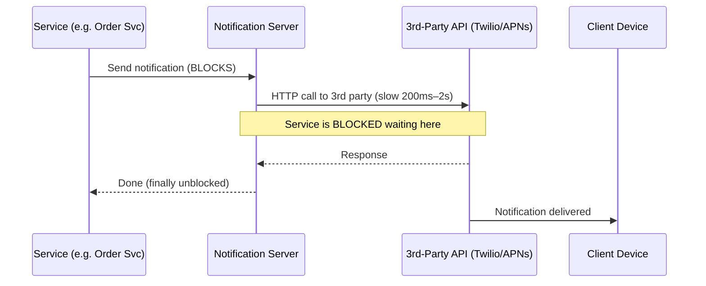
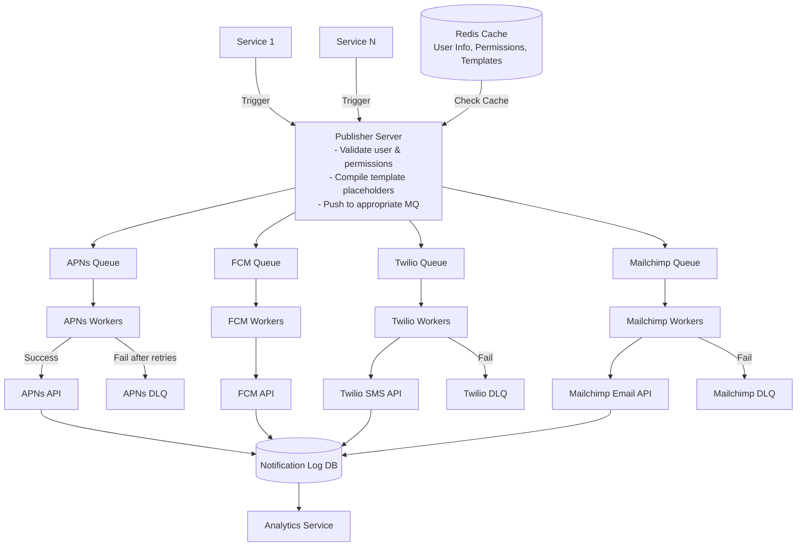
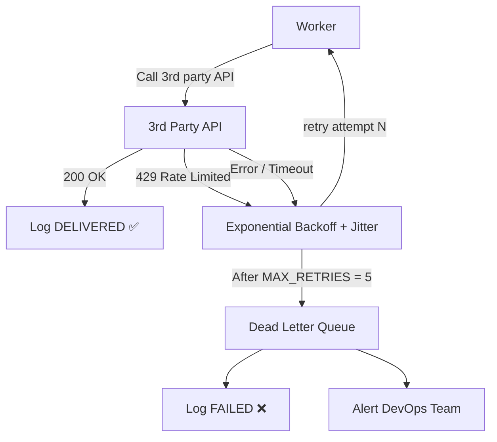
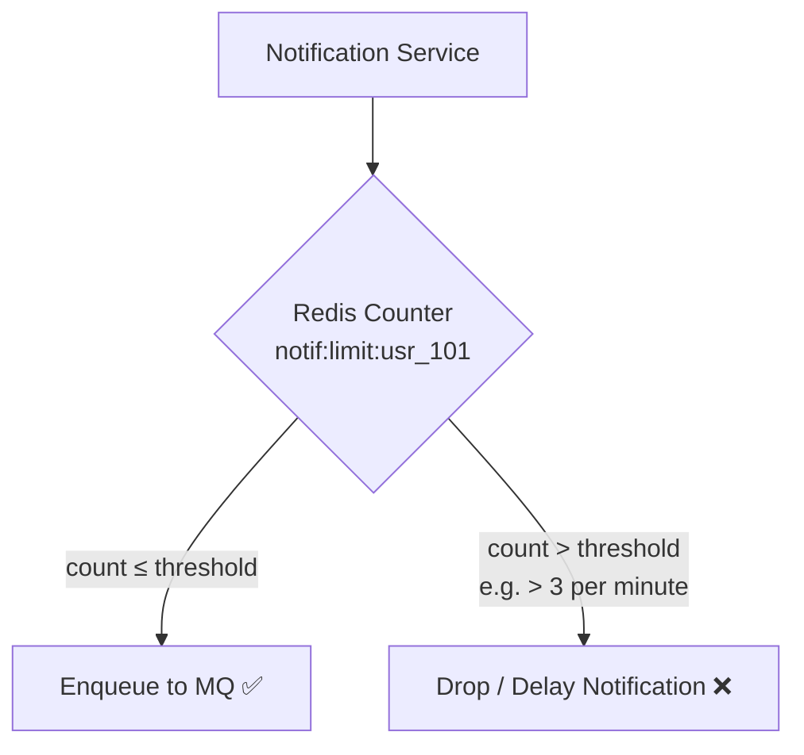

# 📢 HLD Lecture 7 — Notification System Design

A **Notification System** is a vital component in modern applications, responsible for sending critical updates, promotional messages, and security alerts to users across multiple communication channels (Mobile Push, SMS, Email, and In-App).

---

## 📌 1. System Requirements & Core Questions

When designing a notification system, we must clarify the scope by addressing key system requirements.

### Key Questions to Ask in an Interview
1. **What types of notifications do we support?**
   * **Push Notification (Mobile/Web):** High visibility alerts on the device screen (iOS/Android/Web).
   * **SMS Notification:** SMS messages sent to the user's phone number.
   * **Email Notification:** Rich HTML or plain-text emails.
   * **In-App Notification:** Messages shown while the user is actively using the app (e.g., notification center).
2. **What is the system's real-time requirement?**
   * **Real-time System:** Notifications must be delivered *immediately* (e.g., OTP for 2FA).
   * **Soft Real-time System:** We try to deliver notifications as soon as possible, but brief delays are acceptable under high load, network partitions, or 3rd party downtimes.
   * *Decision:* A notification system is designed as a **Soft Real-time System** because it depends on 3rd party external networks.
3. **What devices/platforms do we target?**
   * iOS, Android, and Web browsers (macOS, Windows, Linux).

### Functional Requirements
* **Send Notifications:** Support sending notifications via Push, SMS, and Email.
* **Notification Preferences:** Users can opt-in/opt-out of specific notification types.
* **Notification History:** Users can view their past notification history.
* **Templates:** support dynamic content using predefined templates.

### Non-Functional Requirements
* **High Availability:** System must be available to accept notification requests 24/7.
* **Low Latency:** Delivery should happen within seconds for soft real-time.
* **Reliability (No Data Loss):** Important notifications (like OTPs) must never be lost.
* **Scalability:** Must handle sudden spikes (e.g., flash sales, breaking news alerts).
* **Loose Coupling:** The core application services should not block when triggering a notification.

---

## 📐 2. Core Entities & Basic Flow



1. **Service (Trigger):** Any microservice (e.g., Order Service, Auth Service) or scheduled Cron-job that triggers a notification request.
2. **Notification Service:** The entry point that processes the request, resolves user preferences, generates templates, and validates input.
3. **Executor:** The subsystem/workers that communicate with 3rd-party gateways to dispatch notifications.
4. **Client:** The end-user's device receiving the notification.

---

## 📊 3. Back-of-the-Envelope Calculations (BEC)

### Assumptions:
* **Daily Active Users (DAU):** $1\text{ Million}$
* **Average Notifications per User per Day:** $10$
* **Total Notifications/Day:** $1\text{ Million} \times 10 = 10\text{ Million notifications/day}$

---

### A. Storage Calculations

Every notification metadata log must be stored in the database for history and analytics.
* **Average size of 1 notification record:** $200\text{ bytes}$ (includes `userId`, `notificationId`, `channel`, `content_snippet`, `status`, `timestamp`).

$$\text{Daily Storage} = 10\text{ Million} \times 200\text{ bytes}$$
$$\text{Daily Storage} = 2 \times 10^9\text{ bytes} \approx 2\text{ GB/day}$$

$$\text{Monthly Storage} = 2\text{ GB/day} \times 30\text{ days} = 60\text{ GB/month}$$
$$\text{Yearly Storage} = 60\text{ GB/month} \times 12\text{ months} = 720\text{ GB/year}$$

---

### B. Bandwidth & Load Calculations

Assume the raw payload size (metadata + body + headers) sent to our server averages $1\text{ KB}$ per notification.

$$\text{Total Daily Data Transmitted} = 10\text{ Million} \times 1\text{ KB} = 10\text{ GB/day}$$

#### Average Queries Per Second (QPS):
$$\text{Average QPS} = \frac{10,000,000\text{ notifications}}{86,400\text{ seconds}} \approx 115.7\text{ req/sec}$$

#### Peak QPS (Assuming $3\text{x}$ average load):
$$\text{Peak QPS} = 115.7 \times 3 \approx 350\text{ req/sec}$$

---

## 🛠️ 4. API Interface Design & DB Schema

### A. API Endpoints

#### 1. Retrieve User Settings & Info

* **HTTP Method:** `GET`
* **Path:** `/api/v1/users/{userId}`
* **Response (200 OK):**
```json
{
  "userId": "usr_101",
  "userName": "Aditya",
  "email": "aditya@example.com",
  "mobile": "+919876543210",
  "notificationPermissions": {
    "PUSH": true,
    "EMAIL": true,
    "SMS": false
  }
}
```

#### 2. Send Notification

* **HTTP Method:** `POST`
* **Path:** `/api/v1/notifications/send/{userId}`
* **Request Body:**
```json
{
  "from": "system@app.com",
  "to": "+919876543210",
  "subject": "Order Shipped!",
  "content": "Hi Aditya, your order #10928 has been dispatched.",
  "type": "SMS" 
}
```
* **Response (200 OK):**
```json
{
  "status": "queued",
  "notificationId": "notif_301"
}
```

---

### B. Database Schema Design (SQL DDL)

```sql
CREATE TABLE users (
    user_id VARCHAR(50) PRIMARY KEY,
    username VARCHAR(100) NOT NULL,
    email VARCHAR(150) UNIQUE,
    mobile_number VARCHAR(20) UNIQUE,
    created_at TIMESTAMP DEFAULT CURRENT_TIMESTAMP
);

CREATE TABLE user_permissions (
    user_id VARCHAR(50) PRIMARY KEY,
    allow_push BOOLEAN DEFAULT TRUE,
    allow_email BOOLEAN DEFAULT TRUE,
    allow_sms BOOLEAN DEFAULT TRUE,
    updated_at TIMESTAMP DEFAULT CURRENT_TIMESTAMP ON UPDATE CURRENT_TIMESTAMP,
    FOREIGN KEY (user_id) REFERENCES users(user_id) ON DELETE CASCADE
);

CREATE TABLE notification_templates (
    template_id VARCHAR(50) PRIMARY KEY,
    template_name VARCHAR(100) NOT NULL,
    channel_type VARCHAR(20) NOT NULL,
    subject_template VARCHAR(255),
    body_template TEXT NOT NULL,
    created_at TIMESTAMP DEFAULT CURRENT_TIMESTAMP
);

CREATE TABLE notification_history (
    notification_id VARCHAR(50) PRIMARY KEY,
    user_id VARCHAR(50) NOT NULL,
    channel_type VARCHAR(20) NOT NULL,
    recipient_destination VARCHAR(255) NOT NULL,
    status VARCHAR(20) NOT NULL,
    retry_count INT DEFAULT 0,
    created_at TIMESTAMP DEFAULT CURRENT_TIMESTAMP,
    updated_at TIMESTAMP DEFAULT CURRENT_TIMESTAMP ON UPDATE CURRENT_TIMESTAMP,
    FOREIGN KEY (user_id) REFERENCES users(user_id)
);

CREATE INDEX idx_user_history ON notification_history(user_id, created_at DESC);
```

---

## 🚫 5. Problems with the Initial (Synchronous) Design



### Why this design fails in production:
1. **Single Point of Failure (SPOF):** If the notification server crashes, the entire system's ability to alert users fails.
2. **Synchronous Bottleneck & Latency:** 3rd party APIs can take hundreds of milliseconds or even seconds. The internal service is **blocked** waiting.
3. **Hard to Scale:** During peak traffic, the server gets saturated with no async buffer.
4. **No Retry Mechanism:** If a 3rd party gateway is down, the notification fails permanently.
5. **Tight Coupling:** An email failure could block a checkout transaction.

---

## 🚀 6. Scaled Asynchronous Architecture



### Step-by-Step Flow:
1. **Trigger:** A service sends a request to the Publisher Server.
2. **Caching Check:** Publisher checks **Redis Cache** first. If not in cache, retrieves from DB and updates Redis.
3. **Template Compilation:** Publisher merges request data with template (e.g. replacing `{{userName}}` with `"Aditya"`).
4. **Enqueueing:** Publisher publishes to specific **Message Queue** depending on channel type.
5. **Consumption:** Dedicated Workers pull messages from their respective queues.
6. **Execution:** Workers make asynchronous HTTP calls to the 3rd party API.
7. **Retries:** On failure, message is placed back into queue. After max retries, goes to **Dead Letter Queue (DLQ)**.
8. **Logging & Analytics:** On success or final failure, workers log status to **Notification Log DB**.

---

## 🛡️ 7. Resilience, Fault Tolerance, & Advanced Concepts

### A. Robust Retry Mechanism



#### Example Worker Retrying Pseudocode (Python):
```python
import time
import random

MAX_RETRIES = 5
BASE_DELAY = 2  # seconds

def send_with_retry(notification_message):
    retries = 0
    while retries < MAX_RETRIES:
        try:
            response = call_third_party_gateway(notification_message)
            if response.status_code == 200:
                update_db_status(notification_message.id, "DELIVERED")
                return True
            elif response.status_code == 429:
                print("Rate limited by provider. Retrying...")
            else:
                print("Provider returned error. Retrying...")
        except Exception as e:
            print(f"Network error: {e}. Retrying...")
        
        retries += 1
        # Exponential Backoff with Jitter
        delay = (BASE_DELAY ** retries) + random.uniform(0.5, 1.5)
        print(f"Waiting {delay:.2f} seconds before retry...")
        time.sleep(delay)
        
    move_to_dead_letter_queue(notification_message)
    update_db_status(notification_message.id, "FAILED")
```

---

### B. Notification Templates

Storing entire message text for every request wastes bandwidth and database space. Instead, use templates:

* **Template Definition:** `Hello {{userName}}, your OTP is {{otp}}. Do not share it.`
* **Request Payload:**
```json
{
  "userId": "usr_101",
  "templateId": "tmpl_otp_verification",
  "placeholders": {
    "userName": "Aditya",
    "otp": "482091"
  }
}
```
* **Benefit:** Smaller network footprint, product managers can update copy in DB without backend code changes.

---

### C. Rate Limiting & User-Level Spam Prevention

To prevent spamming users (e.g., a buggy system loop sending 50 emails to a customer in 2 minutes):



---

### D. Security & Authentication
* **Internal Security:** Use API Key validation or JWTs to authenticate microservices communicating with the notification server.
* **3rd Party Credentials:** Store provider API keys in secure secret managers (e.g., AWS Secrets Manager, HashiCorp Vault).

---

### E. Monitoring & Observability
Key metrics to track in production:
* **Queue Size / Depth:** If the FCM queue is growing rapidly, workers are falling behind or Firebase is experiencing downtime.
* **Delivery Latency:** Time elapsed from publisher ingest to client receipt.
* **Error Rate:** Percentage of failed API calls grouped by 3rd-party provider.
* **System Saturation:** CPU and memory utilization of worker instances to trigger auto-scaling.
