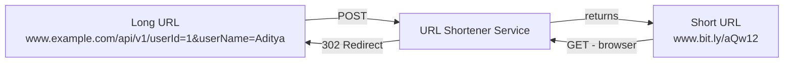
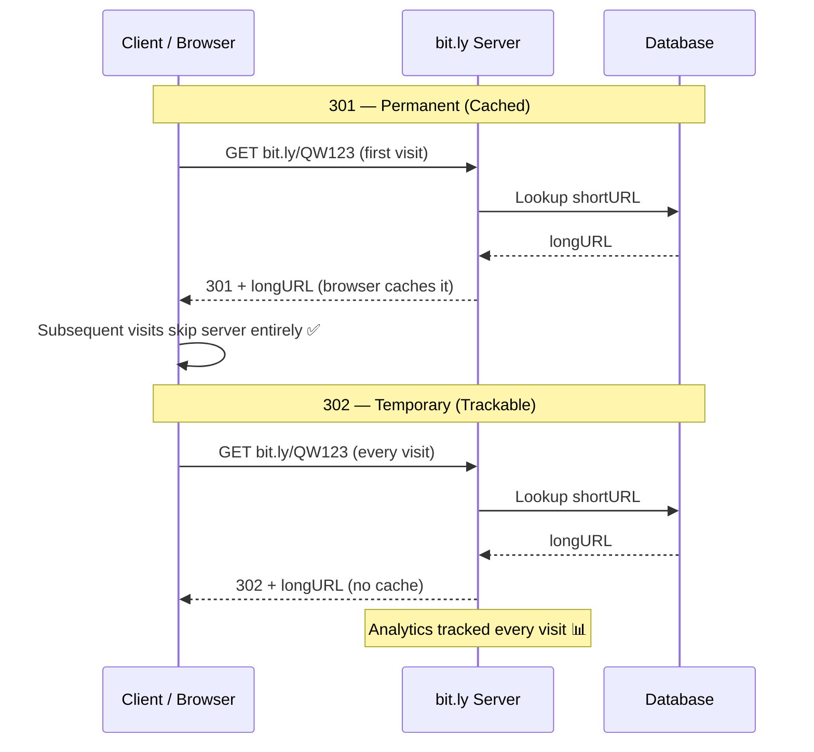
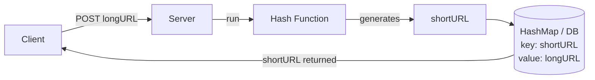
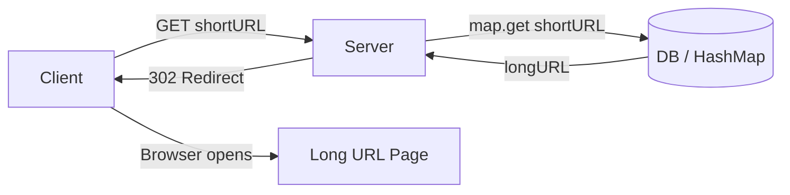
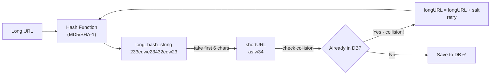
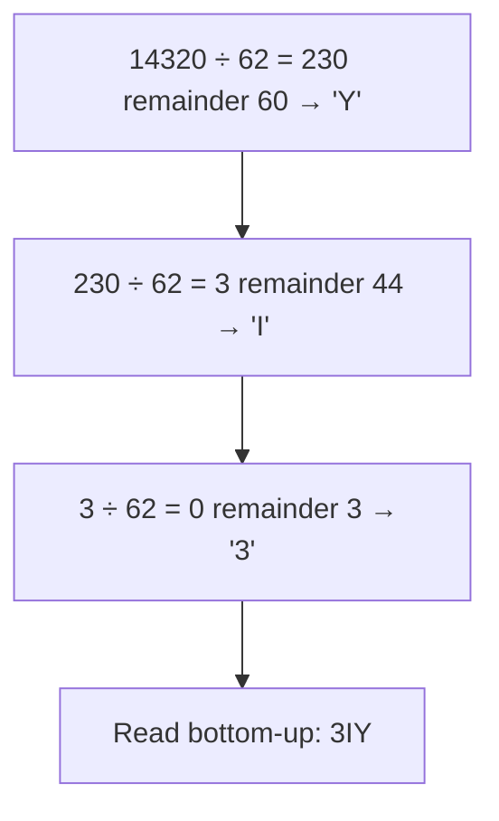
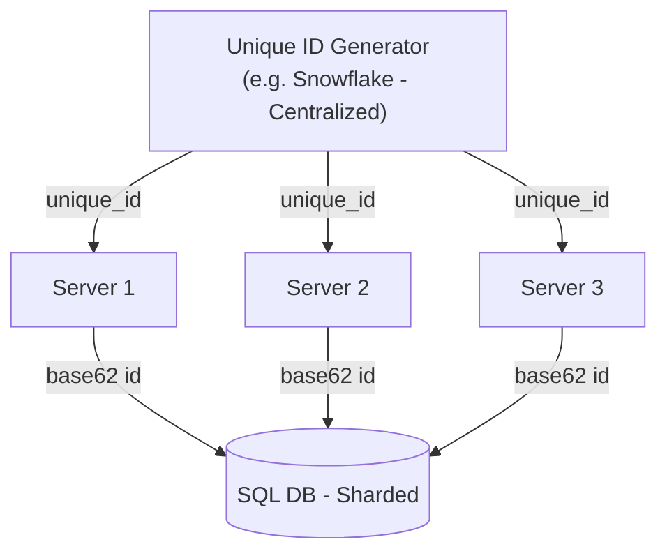
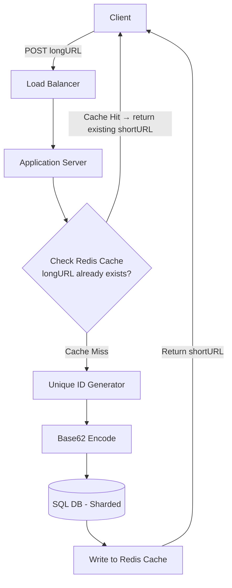
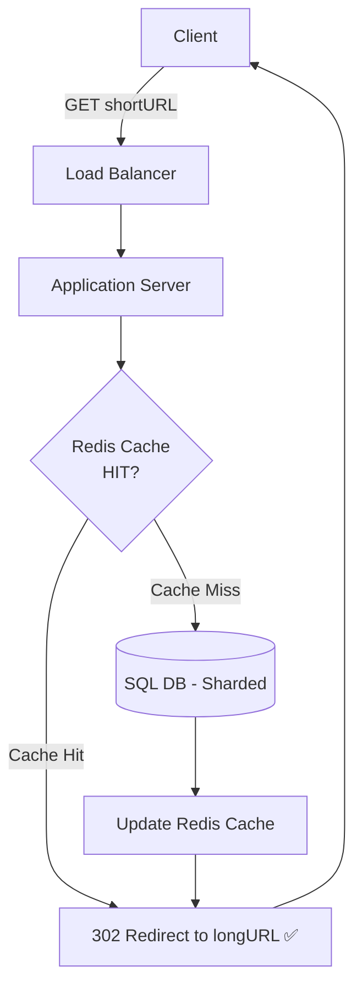

# 🔗 System Design — URL Shortener (Bit.ly Clone)
> **HLD Lecture 6** · High-Level Design · Open-Ended Interview Question

---

## 📌 Table of Contents

1. [Problem Statement](#1-problem-statement)
2. [Clarifying Questions](#2-clarifying-questions)
3. [Back-of-the-Envelope Estimation](#3-back-of-the-envelope-estimation)
4. [API Design](#4-api-design)
5. [Redirection — 301 vs 302](#5-redirection--301-vs-302)
6. [Initial Flow Design](#6-initial-flow-design)
7. [Database Choice — NoSQL vs SQL](#7-database-choice--nosql-vs-sql)
8. [Short URL Generation Strategies](#8-short-url-generation-strategies)
9. [Distributed Architecture](#9-distributed-architecture)
10. [Key Takeaways](#10-key-takeaways)

---

## 1. Problem Statement

Design a **URL Shortener** service like **[Bit.ly](https://bit.ly)**.



| Direction | Example |
|-----------|---------|
| Long → Short | `www.example.com/api/v1/userId=1&userName=Aditya` → `www.bit.ly/aQw12` |
| Short → Long | `www.bit.ly/aQw12` → browser redirects to original URL |

---

## 2. Clarifying Questions

These are the **first questions you must ask in an HLD interview**. They define the entire system scope.

### ❓ Q1 — Scale: How many URLs are we targeting?
> **Answer: 20 million URLs / day**

### ❓ Q2 — How short should the URL be?
> **Answer: As short as possible**

### ❓ Q3 — What characters can we use in the short URL?
> **Answer: `0–9`, `a–z`, `A–Z` → Total 62 characters**

---

## 3. Back-of-the-Envelope Estimation

This is a **critical skill** in system design interviews. Always calculate before designing.

### ⚡ QPS (Queries Per Second)

```
Write Operations (URL Generation):
  20 million URLs/day ÷ 86,400 seconds ≈ 231 write ops/sec

Read Operations (URL Redirects):
  Write : Read = 1 : 10
  231 × 10 = 2,310 read ops/sec
```

### 💾 Storage Estimation (5 Years)

```
Records = 20 million/day × 365 days × 5 years ≈ 36.5 Billion records
Size per record = 100 bytes
Total Storage = 36.5 Billion × 100 bytes ≈ 3.65 TB
```

| Metric | Value |
|--------|-------|
| Write QPS | ~231 ops/sec |
| Read QPS | ~2,310 ops/sec |
| Total Records (5 yrs) | ~36.5 Billion |
| Storage Required | ~3.65 TB |

---

## 4. API Design

Two core endpoints power the entire service.

### 🔵 POST — Generate Short URL

```http
POST www.bit.ly/api/v1/generate
Content-Type: application/json

Body:
{
  "longURL": "https://www.example.com/api/v1/userId=124"
}

Response:
{
  "shortURL": "www.bit.ly/3IY"
}
```

### 🟢 GET — Redirect to Long URL

```http
GET www.bit.ly/{shortURL}

Example:
GET www.bit.ly/3IY

Response: 302 Redirect → https://www.example.com/api/v1/userId=124
```

---

## 5. Redirection — 301 vs 302

> 🔑 This is a **classic interview trap**. Know the difference deeply.

### HTTP Status Code Comparison

| Code | Name | Behaviour | Caching | Server Load |
|------|------|-----------|---------|-------------|
| `301` | Permanent Redirect | Browser caches forever | ✅ Client-side cached | 🔻 Minimal DB hits |
| `302` | Temporary Redirect | No cache, hits server each time | ❌ Always hits server | ✅ Trackable |



### ✅ Which to Use?

> **Use `302`** for production URL shorteners — enables user metrics, A/B testing, click tracking.

---

## 6. Initial Flow Design

### URL Shortening Flow (POST)



**Steps:**
1. User sends a `POST` request with the `longURL`
2. Server runs it through a **Hash Function** (MD5/SHA-1/SHA-256)
3. Generated `shortURL` stored as **key**, `longURL` as **value**
4. `shortURL` returned to user

---

### URL Redirection Flow (GET)



---

## 7. Database Choice — NoSQL vs SQL

### Initial Thought: NoSQL (Amazon DynamoDB / MongoDB)

```
Hashmap in Memory → NoSQL (Key-Value Store)
  Key:   shortURL
  Value: longURL
```

**Why NoSQL seems natural:**
- Key-value access pattern
- Simple structure

---

### Better Choice: ✅ SQL

```sql
CREATE TABLE urls (
  id        BIGINT PRIMARY KEY,   -- Unique ID (used for Base62)
  shortURL  VARCHAR(10),
  longURL   TEXT
);

-- Index for fast lookup
CREATE INDEX idx_short ON urls(shortURL);
```

**Why SQL wins:**

| Feature | NoSQL | SQL ✅ |
|---------|-------|--------|
| Complex queries | ❌ Limited | ✅ Full support |
| Write speed | Slower | **Faster** |
| Analytics queries | Hard | **Easy** |
| User-level stats | Hard | **Easy JOIN** |
| Indexing | Basic | **Advanced** |

---

## 8. Short URL Generation Strategies

### 🔢 Calculating URL Length

**Available characters:** `0–9`, `a–z`, `A–Z` → **62 symbols**

```
n=6 → 62^6 = 56,800,235,584 URLs  ← ~56 Billion ✅
Need: 36.5 Billion  →  n = 6 is sufficient
```

---

### Strategy 1: Hashing (MD5 / SHA-1 / SHA-256)



**Disadvantages:**
- 📈 DB hits increase significantly
- 🐢 Slow — recursive calls on collision
- ⚡ Not suitable for high-QPS systems

---

### Strategy 2: ✅ Base62 Encoding (Recommended)

> **This is the industry-standard approach.**

#### Base62 Conversion Table

| Base 10 | Base 62 |
|---------|---------|
| 0 | `0` |
| 9 | `9` |
| 10 | `a` |
| 35 | `z` |
| 36 | `A` |
| 61 | `Z` |

#### Example: Convert `14320` to Base62



```
Long URL: www.example.com   Unique ID: 14320   Short URL: www.bit.ly/3IY ✅
```

| | Base62 ✅ |
|-|-----------|
| ✅ Collision-free | Always unique (ID is unique → encoded value is unique) |
| ✅ Fast | No recursive lookup needed |
| ❌ Needs unique ID generator | Distributed systems need coordination |
| ❌ Guessable | Sequential IDs → next URL is predictable |

---

## 9. Distributed Architecture

### The Core Challenge

> In a distributed system with **multiple DB shards**, each shard generates its own IDs — **two shards can generate the same ID!**



### Complete System Architecture — POST (Store)



### Complete System Architecture — GET (Redirect)



> 💡 **Cache Strategy**: Cache hot short URLs (most clicked). Use **LRU eviction**.

---

## 10. Key Takeaways

| Concept | Decision | Reason |
|---------|----------|--------|
| Redirect code | **302** | Analytics & tracking |
| Database | **SQL** | Complex queries, better write speed |
| ID generation | **Base62** | Collision-free, fast |
| Caching | **Redis (LRU)** | Reduce DB reads by ~80% |
| URL length | **6 chars** | 56B combos > 36.5B needed |
| ID coordination | **Centralized generator** | Avoid duplicate IDs in shards |

---

### 🏗️ Professional Systems That Use These Patterns

| Company | What They Do | Pattern Used |
|---------|-------------|--------------|
| [Bit.ly](https://bit.ly) | URL Shortener | Base62, 302, Redis |
| [TinyURL](https://tinyurl.com) | URL Shortener | Hashing + collision handling |
| [YouTube](https://youtube.com) | Video IDs | Base64 encoding |
| [Instagram](https://instagram.com) | Photo IDs | Base62 + Snowflake IDs |
| [Twitter/X](https://twitter.com) | Tweet IDs | Snowflake (distributed ID gen) |

---

### 📊 Interview Checklist

```
[ ] Ask clarifying questions (scale, constraints, characters)
[ ] Do back-of-the-envelope estimation (QPS, storage)
[ ] Design API endpoints (POST generate, GET redirect)
[ ] Decide redirect type (301 vs 302 — always 302)
[ ] Choose DB (SQL > NoSQL for this use case)
[ ] Decide URL generation strategy (Base62 > Hashing)
[ ] Plan for distributed system (sharding, ID gen, cache)
[ ] Mention cache layer (Redis, LRU eviction)
```

---

*Notes from HLD Lecture 6 · URL Shortener (Bit.ly Clone) · System Design*
